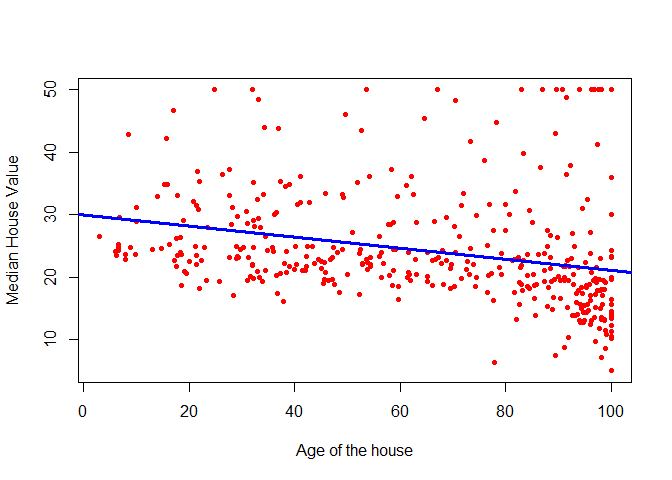
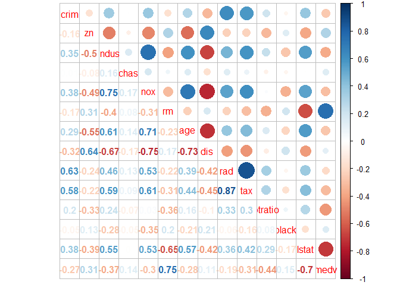
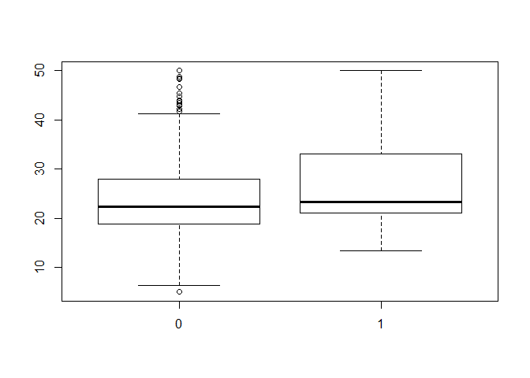

### In this practical work, we will continue the analysis of the Boston data set. Recall that this dataset records the median value of houses for 506 neighborhoods around Boston. Our task is to predict the median house value (medv).

### 1.Load the Boston dataset from MASS package.


```r
library(MASS)
#(Boston will be charged with the MASS package, or we can do directly data <- MASS::Boston)

# to verify the dimensions
dim(Boston)
```

```
## [1] 506  14
```


### 2. Split the dataset into traning set and testing set.


```r
# for instance, we will do it manually
train = 1:400
test = -train
training_data = Boston[train, ] 
testing_data = Boston[test, ]

# Check the dimensions of the new dataset
dim(training_data)
```

```
## [1] 400  14
```

### 3. Check if there is a linear relationship between the variables medv and age. (use cor() function).


```r
# check either in the training set or the original
cor(training_data$medv,training_data$age)
```

```
## [1] -0.278153
```

### 4. Fit a model of housing prices in function of age and plot the observations and the regression line.

```r
model1 <- lm(medv ~ age , data= training_data)
plot(training_data$age, training_data$medv,
xlab = "Age of the house",
ylab = "Median House Value",
col = "red",
pch = 20)

abline(model1, col = "blue", lwd =3)
```

<!-- -->

### 5. Train a regression model using both lstat and age as predictors of median house value. (Remember that we transformed lstat, use the same transformation here).

```r
model2 <- lm(medv ~ log(lstat) + age , data= training_data)

model2
```

```
## 
## Call:
## lm(formula = medv ~ log(lstat) + age, data = training_data)
## 
## Coefficients:
## (Intercept)   log(lstat)          age  
##    51.60212    -14.33897      0.07779
```

```r
#Y= 51.60212 - 14.33897 log(stat) + 0.07779 age
```


```r
# Here we have 2 predictors.
# In a 3-d plot, the regression model is a plane.
```


```r
#(3d plot -- rotate using the cursor)

rgl::plot3d(log(Boston$lstat),
            Boston$age,
            Boston$medv, type = "p",
            xlab = "log(lstat)",
            ylab = "age",
            zlab = "medv", site = 5, lwd = 15)


rgl::planes3d(model2$coefficients["log(lstat)"],
              model2$coefficients["age"], -1,
              model2$coefficients["(Intercept)"], alpha = 0.3, front = "line")
```

### 6. Print the summary of the obtained regression model.


```r
summary(model2)
```

```
## 
## Call:
## lm(formula = medv ~ log(lstat) + age, data = training_data)
## 
## Residuals:
##      Min       1Q   Median       3Q      Max 
## -13.5262  -3.3942  -0.8392   2.7503  22.9450 
## 
## Coefficients:
##              Estimate Std. Error t value Pr(>|t|)    
## (Intercept)  51.60212    1.03643  49.788  < 2e-16 ***
## log(lstat)  -14.33897    0.53904 -26.601  < 2e-16 ***
## age           0.07779    0.01106   7.034 8.85e-12 ***
## ---
## Signif. codes:  0 '***' 0.001 '**' 0.01 '*' 0.05 '.' 0.1 ' ' 1
## 
## Residual standard error: 5.292 on 397 degrees of freedom
## Multiple R-squared:  0.6684,	Adjusted R-squared:  0.6667 
## F-statistic: 400.1 on 2 and 397 DF,  p-value: < 2.2e-16
```

### 7. Are the predictors significant ?


```r
#Looking at the p-values all the predictors here are significant
```

### 8. Is the model as a whole significant? 


```r
# the p-value of the Fisher's test is close to 0 (last line of summary table)
# here the model is significant (at least one coefficient non-nul)
```


### 9. Train a new model using all the variables of the dataset.


```r
model3 <- lm(medv ~ . , data=training_data)
summary(model3)
```

```
## 
## Call:
## lm(formula = medv ~ ., data = training_data)
## 
## Residuals:
##      Min       1Q   Median       3Q      Max 
## -20.5636  -2.6945  -0.6151   1.6949  25.0328 
## 
## Coefficients:
##               Estimate Std. Error t value Pr(>|t|)    
## (Intercept)  28.672600   6.151703   4.661 4.34e-06 ***
## crim         -0.191246   0.054036  -3.539 0.000450 ***
## zn            0.044229   0.014111   3.134 0.001854 ** 
## indus         0.055221   0.065532   0.843 0.399944    
## chas          1.716314   0.891171   1.926 0.054850 .  
## nox         -14.995722   4.557588  -3.290 0.001093 ** 
## rm            4.887730   0.484947  10.079  < 2e-16 ***
## age           0.002609   0.014330   0.182 0.855615    
## dis          -1.294808   0.211724  -6.116 2.36e-09 ***
## rad           0.484787   0.087347   5.550 5.31e-08 ***
## tax          -0.015401   0.004447  -3.463 0.000594 ***
## ptratio      -0.808795   0.140085  -5.774 1.60e-08 ***
## black        -0.001292   0.006537  -0.198 0.843381    
## lstat        -0.517954   0.059511  -8.704  < 2e-16 ***
## ---
## Signif. codes:  0 '***' 0.001 '**' 0.01 '*' 0.05 '.' 0.1 ' ' 1
## 
## Residual standard error: 4.808 on 386 degrees of freedom
## Multiple R-squared:  0.7339,	Adjusted R-squared:  0.7249 
## F-statistic: 81.87 on 13 and 386 DF,  p-value: < 2.2e-16
```

### 10. Re train the model using log(lstat) instead of lstat.


```r
model4 <- lm(medv ~ . -lstat + log(lstat) , data=training_data)
```

### 11. Did \pgfmathprintnumber[print sign]{\intercept}$R^2$ improve ?  


```r
summary(model3)$r.squared
```

```
## [1] 0.7338501
```

```r
summary(model4)$r.squared
```

```
## [1] 0.7849629
```


```r
# or 
summary(model4)$r.squared > summary(model3)$r.squared
```

```
## [1] TRUE
```

### 12. To see if there is correlated variables print the correlation matrix using the cor() function (round the correlations with 2 digits). And visualize the correlations using corrplot.


```r
library(corrplot)
```

```
## Warning: package 'corrplot' was built under R version 3.4.4
```

```
## corrplot 0.84 loaded
```

```r
#round(cor(training_data),2)
corrplot.mixed(cor(training_data))
```

<!-- -->

### 14. What is the correlation between tax and rad?


```r
#0.87 high correlation
```

### 15. Run the model again without tax. What happens to the \pgfmathprintnumber[print sign]{\intercept}$R^2$ ? and for the F-statistic?


```r
model5 <- lm(medv ~ . -lstat + log(lstat) - tax, data=training_data)
summary(model5)
```

```
## 
## Call:
## lm(formula = medv ~ . - lstat + log(lstat) - tax, data = training_data)
## 
## Residuals:
##      Min       1Q   Median       3Q      Max 
## -18.8470  -2.5354  -0.2791   1.9508  23.3798 
## 
## Coefficients:
##               Estimate Std. Error t value Pr(>|t|)    
## (Intercept)  4.624e+01  5.944e+00   7.779 6.70e-14 ***
## crim        -1.844e-01  4.877e-02  -3.782 0.000180 ***
## zn           1.692e-02  1.261e-02   1.341 0.180600    
## indus       -3.080e-02  5.686e-02  -0.542 0.588310    
## chas         1.845e+00  8.096e-01   2.279 0.023184 *  
## nox         -1.598e+01  4.123e+00  -3.876 0.000125 ***
## rm           3.431e+00  4.681e-01   7.329 1.36e-12 ***
## age          2.882e-02  1.334e-02   2.160 0.031412 *  
## dis         -1.146e+00  1.939e-01  -5.909 7.54e-09 ***
## rad          2.063e-01  5.403e-02   3.817 0.000157 ***
## ptratio     -7.658e-01  1.279e-01  -5.989 4.82e-09 ***
## black        3.066e-04  5.940e-03   0.052 0.958855    
## log(lstat)  -8.753e+00  6.558e-01 -13.347  < 2e-16 ***
## ---
## Signif. codes:  0 '***' 0.001 '**' 0.01 '*' 0.05 '.' 0.1 ' ' 1
## 
## Residual standard error: 4.39 on 387 degrees of freedom
## Multiple R-squared:  0.7775,	Adjusted R-squared:  0.7706 
## F-statistic: 112.7 on 12 and 387 DF,  p-value: < 2.2e-16
```


```r
# R² is lower because we deleted one of the variables
# but the model significance (F-statistic) gets higher, which means the p-value gets lower and thus the model is more significant without tax.
```

### 16. Calculate the mean squared error (MSE) for the last model.


```r
# Save the testing median values for houses (testing y) in y
y = testing_data$medv

# Compute the predicted value for this y (y hat)
y_hat = predict(model5, data.frame(testing_data))

# Now we have both y and y_hat for our testing data. 
# let's find the mean square error
error = y-y_hat
error_squared = error^2
MSE = mean(error_squared)
MSE
```

```
## [1] 23.33963
```

## Anova

### 17. In the Boston data set there is a categorical variable chas which corresponds to Charles River (= 1 if a suburb bounds the river; 0 otherwise). Use command str() to see how this variable is present in the dataset. How many of the suburbs in this data set bound the Charles river?


```r
# how many of the suburbs <=> how many 1
table(training_data$chas) # tableau des effectifs
```

```
## 
##   0   1 
## 365  35
```


```r
# or
sum(training_data$chas == 1)
```

```
## [1] 35
```

### 18. Create Boxplots of the median value of houses with respect to the variable chas.


```r
boxplot(medv~chas, data=training_data)
```

<!-- -->


```r
# higher prices if near river? 
```

### 18. Calculate the mean of medv and mean of chas using aggregate()


```r
aggregate(formula=medv~chas, data=training_data, FUN=mean)
```

```
##   chas     medv
## 1    0 23.94082
## 2    1 28.44000
```

### 20. Apply an ANOVA test of medv whith respect to chas using aov())


```r
anovatest <- aov(medv~chas, data= training_data)
anovatest
```

```
## Call:
##    aov(formula = medv ~ chas, data = training_data)
## 
## Terms:
##                     chas Residuals
## Sum of Squares    646.50  32876.31
## Deg. of Freedom        1       398
## 
## Residual standard error: 9.088662
## Estimated effects may be unbalanced
```


```r
summary(anovatest)
```

```
##              Df Sum Sq Mean Sq F value Pr(>F)   
## chas          1    646   646.5   7.826 0.0054 **
## Residuals   398  32876    82.6                  
## ---
## Signif. codes:  0 '***' 0.001 '**' 0.01 '*' 0.05 '.' 0.1 ' ' 1
```


```r
# There is a significant difference in price if the house is close to the river or not
```

## Qualitative Predictors

### 21. Fit a new model where the predictors are the Charles River and the Crime Rate.


```r
model21 <- lm(medv~chas+crim,data=training_data)
model21
```

```
## 
## Call:
## lm(formula = medv ~ chas + crim, data = training_data)
## 
## Coefficients:
## (Intercept)         chas         crim  
##     24.6506       4.5442      -0.4076
```


```r
summary(model21)
```

```
## 
## Call:
## lm(formula = medv ~ chas + crim, data = training_data)
## 
## Residuals:
##     Min      1Q  Median      3Q     Max 
## -14.441  -5.823  -2.127   3.779  29.113 
## 
## Coefficients:
##             Estimate Std. Error t value Pr(>|t|)    
## (Intercept) 24.65057    0.47619  51.766  < 2e-16 ***
## chas         4.54421    1.55098   2.930  0.00359 ** 
## crim        -0.40762    0.07328  -5.562  4.9e-08 ***
## ---
## Signif. codes:  0 '***' 0.001 '**' 0.01 '*' 0.05 '.' 0.1 ' ' 1
## 
## Residual standard error: 8.765 on 397 degrees of freedom
## Multiple R-squared:  0.09019,	Adjusted R-squared:  0.0856 
## F-statistic: 19.68 on 2 and 397 DF,  p-value: 7.11e-09
```


```r
# in this model, chas is significant
```

### 22. Is chas is significant as well in the presence of more predictors?


```r
model22 <- lm(medv~.,data=training_data)
summary(model22)
```

```
## 
## Call:
## lm(formula = medv ~ ., data = training_data)
## 
## Residuals:
##      Min       1Q   Median       3Q      Max 
## -20.5636  -2.6945  -0.6151   1.6949  25.0328 
## 
## Coefficients:
##               Estimate Std. Error t value Pr(>|t|)    
## (Intercept)  28.672600   6.151703   4.661 4.34e-06 ***
## crim         -0.191246   0.054036  -3.539 0.000450 ***
## zn            0.044229   0.014111   3.134 0.001854 ** 
## indus         0.055221   0.065532   0.843 0.399944    
## chas          1.716314   0.891171   1.926 0.054850 .  
## nox         -14.995722   4.557588  -3.290 0.001093 ** 
## rm            4.887730   0.484947  10.079  < 2e-16 ***
## age           0.002609   0.014330   0.182 0.855615    
## dis          -1.294808   0.211724  -6.116 2.36e-09 ***
## rad           0.484787   0.087347   5.550 5.31e-08 ***
## tax          -0.015401   0.004447  -3.463 0.000594 ***
## ptratio      -0.808795   0.140085  -5.774 1.60e-08 ***
## black        -0.001292   0.006537  -0.198 0.843381    
## lstat        -0.517954   0.059511  -8.704  < 2e-16 ***
## ---
## Signif. codes:  0 '***' 0.001 '**' 0.01 '*' 0.05 '.' 0.1 ' ' 1
## 
## Residual standard error: 4.808 on 386 degrees of freedom
## Multiple R-squared:  0.7339,	Adjusted R-squared:  0.7249 
## F-statistic: 81.87 on 13 and 386 DF,  p-value: < 2.2e-16
```


```r
# significant with error 5%, so we are less confident that it is significant than before
```


