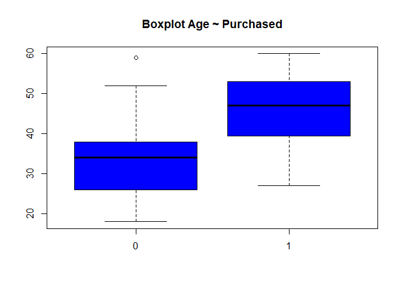
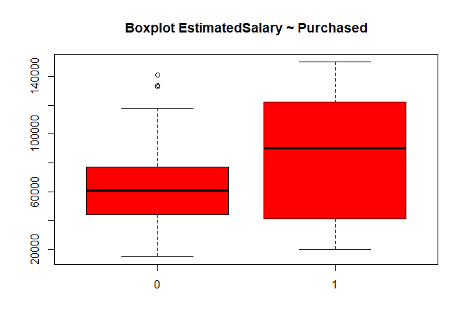
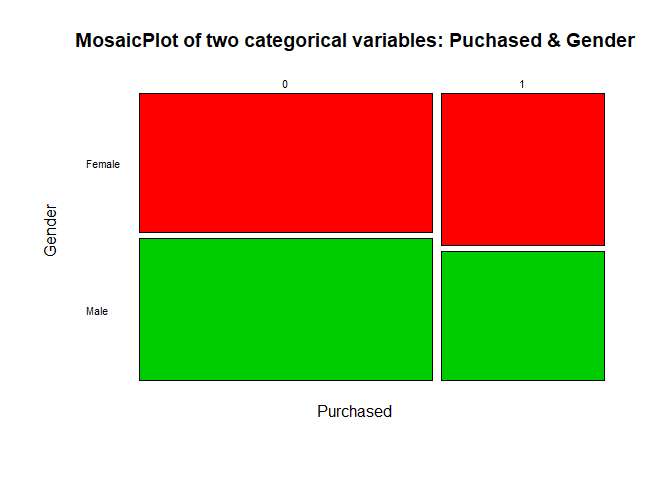
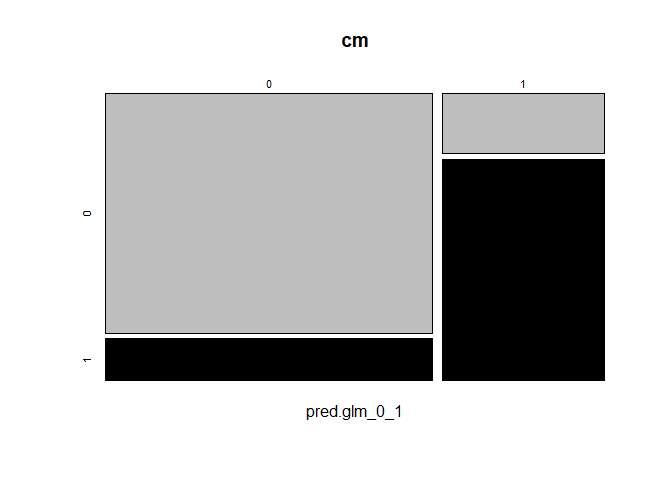
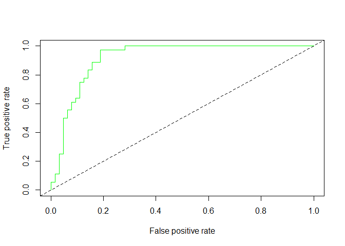
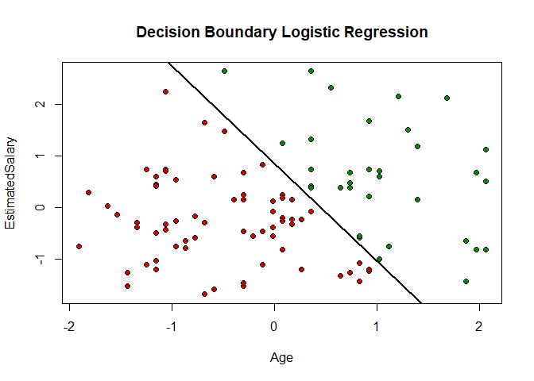
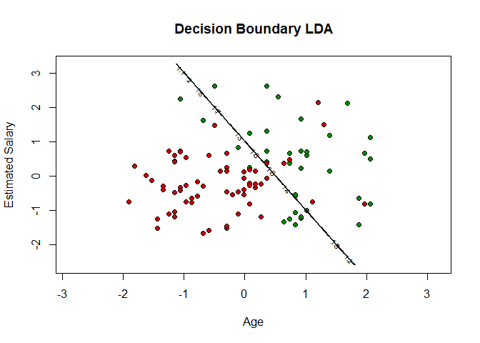
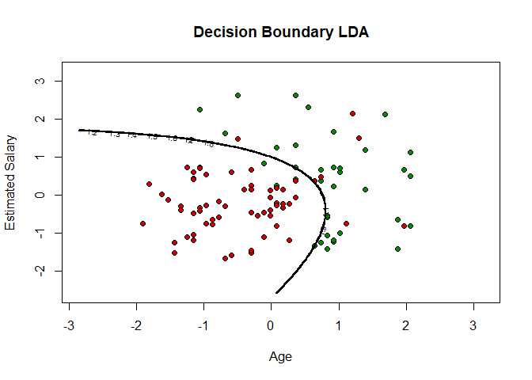
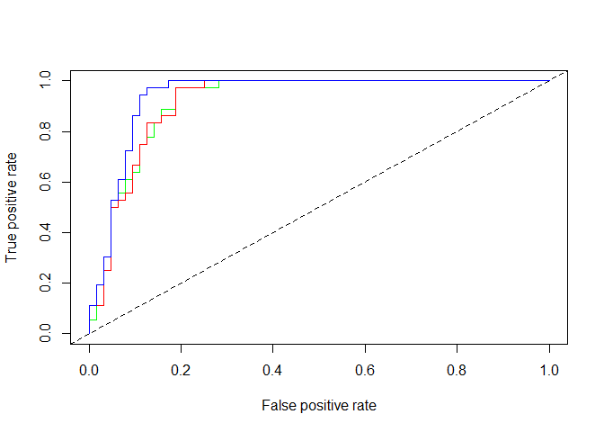

#PW4

This week we are going to continue the analysis of the Social_Network_Ads dataset . Recall that this dataset contains informations of users of a social network and if they bought a specified product. Last week we built a Logistic Regression model for the variable Purchased in function of Age and EstimatedSalary. We will consider the same variables this week but we will fit different models using methods such as LDA, QDA, and Naive Bayes.

#Logistic Regression

First, let's do the pre-processing steps you were asked to do during the last session and fit a logistic regression model.


```r
dataset <- read.csv("Social_Network_Ads.csv", header = TRUE)
str(dataset)
```

```
## 'data.frame':	400 obs. of  5 variables:
##  $ User.ID        : int  15624510 15810944 15668575 15603246 15804002 15728773 15598044 15694829 15600575 15727311 ...
##  $ Gender         : Factor w/ 2 levels "Female","Male": 2 2 1 1 2 2 1 1 2 1 ...
##  $ Age            : num  19 35 26 27 19 27 27 32 25 35 ...
##  $ EstimatedSalary: num  19000 20000 43000 57000 76000 58000 84000 150000 33000 65000 ...
##  $ Purchased      : int  0 0 0 0 0 0 0 1 0 0 ...
```


```r
summary(dataset)
```

```
##     User.ID            Gender         Age        EstimatedSalary 
##  Min.   :15566689   Female:204   Min.   :18.00   Min.   : 15000  
##  1st Qu.:15626764   Male  :196   1st Qu.:29.75   1st Qu.: 43000  
##  Median :15694342                Median :37.00   Median : 70000  
##  Mean   :15691540                Mean   :37.66   Mean   : 69743  
##  3rd Qu.:15750363                3rd Qu.:46.00   3rd Qu.: 88000  
##  Max.   :15815236                Max.   :60.00   Max.   :150000  
##    Purchased     
##  Min.   :0.0000  
##  1st Qu.:0.0000  
##  Median :0.0000  
##  Mean   :0.3575  
##  3rd Qu.:1.0000  
##  Max.   :1.0000
```


```r
boxplot(Age ~ Purchased, data=dataset, col = "blue", main="Boxplot Age ~ Purchased")
```

<!-- -->


```r
boxplot(EstimatedSalary ~ Purchased, data=dataset,col = "red", main="Boxplot EstimatedSalary ~ Purchased")
```

<!-- -->

##Anova Test


```r
aov(EstimatedSalary ~Purchased, data=dataset)
```

```
## Call:
##    aov(formula = EstimatedSalary ~ Purchased, data = dataset)
## 
## Terms:
##                    Purchased    Residuals
## Sum of Squares   60816378455 403062099045
## Deg. of Freedom            1          398
## 
## Residual standard error: 31823.24
## Estimated effects may be unbalanced
```


```r
#we need to show the summary of it in order to see the p-value and to interpret.

summary(aov(EstimatedSalary ~Purchased, data=dataset))
```

```
##              Df    Sum Sq   Mean Sq F value   Pr(>F)    
## Purchased     1 6.082e+10 6.082e+10   60.05 7.77e-14 ***
## Residuals   398 4.031e+11 1.013e+09                     
## ---
## Signif. codes:  0 '***' 0.001 '**' 0.01 '*' 0.05 '.' 0.1 ' ' 1
```

P-value close to 0, EstimatedSalary seems correlated to Purchased


```r
# Now another anova test for the variable Age
summary(aov(Age ~Purchased, data=dataset))
```

```
##              Df Sum Sq Mean Sq F value Pr(>F)    
## Purchased     1  16988   16988   251.7 <2e-16 ***
## Residuals   398  26858      67                   
## ---
## Signif. codes:  0 '***' 0.001 '**' 0.01 '*' 0.05 '.' 0.1 ' ' 1
```


```r
# There is a categorical variable in the dataset, which is Gender.
# Of course we cannot show a boxplot of Gender and Purchased.
# But we can show a table, or a mosaic plot, both tell the same thing.
table(dataset$Gender,dataset$Purchased)
```

```
##         
##            0   1
##   Female 127  77
##   Male   130  66
```


```r
# Remark for the function table(), that in lines we have the first argument, and in columns we have the second argument.
# Don't forget this when you use table() to show a confusion matrix!
mosaicplot(~ Purchased + Gender, data=dataset,main = "MosaicPlot of two categorical variables: Puchased & Gender",color = 2:3, las = 1)
```

<!-- -->


```r
# Let's say we want to remove the first two columns as we are not going to use them.
# But, we can in fact use a categorical variable as a predictor in logistic regression.
# It will treat it the same way as in regression.

dataset = dataset[3:5]
str(dataset)
```

```
## 'data.frame':	400 obs. of  3 variables:
##  $ Age            : num  19 35 26 27 19 27 27 32 25 35 ...
##  $ EstimatedSalary: num  19000 20000 43000 57000 76000 58000 84000 150000 33000 65000 ...
##  $ Purchased      : int  0 0 0 0 0 0 0 1 0 0 ...
```

##Splitting the dataset into training and testing sets


```r
library(caTools)
```

```
## Warning: package 'caTools' was built under R version 3.4.4
```

```r
set.seed(123) 
split = sample.split(dataset$Purchased, SplitRatio = 0.75)
training_set = subset(dataset, split == TRUE)
test_set = subset(dataset, split == FALSE)
```

##Scaling


```r
# So here, we have two continuous predictors, Age and EstimatedSalary.
# There is a very big difference in their scales (units).
# That's why we scale them

training_set[-3] <- scale(training_set[-3]) #only first two columns
test_set[-3] <- scale(test_set[-3])
```

##Logistic Regression


```r
classifier.logreg <- glm(Purchased ~ Age + EstimatedSalary , family = binomial, data=training_set)
classifier.logreg
```

```
## 
## Call:  glm(formula = Purchased ~ Age + EstimatedSalary, family = binomial, 
##     data = training_set)
## 
## Coefficients:
##     (Intercept)              Age  EstimatedSalary  
##          -1.192            2.632            1.395  
## 
## Degrees of Freedom: 299 Total (i.e. Null);  297 Residual
## Null Deviance:	    390.9 
## Residual Deviance: 199.8 	AIC: 205.8
```


```r
summary(classifier.logreg)
```

```
## 
## Call:
## glm(formula = Purchased ~ Age + EstimatedSalary, family = binomial, 
##     data = training_set)
## 
## Deviance Residuals: 
##     Min       1Q   Median       3Q      Max  
## -3.0753  -0.5235  -0.1161   0.3224   2.3977  
## 
## Coefficients:
##                 Estimate Std. Error z value Pr(>|z|)    
## (Intercept)      -1.1923     0.2018  -5.908 3.47e-09 ***
## Age               2.6324     0.3461   7.606 2.83e-14 ***
## EstimatedSalary   1.3947     0.2326   5.996 2.03e-09 ***
## ---
## Signif. codes:  0 '***' 0.001 '**' 0.01 '*' 0.05 '.' 0.1 ' ' 1
## 
## (Dispersion parameter for binomial family taken to be 1)
## 
##     Null deviance: 390.89  on 299  degrees of freedom
## Residual deviance: 199.78  on 297  degrees of freedom
## AIC: 205.78
## 
## Number of Fisher Scoring iterations: 6
```


```r
# prediction
pred.glm = predict(classifier.logreg, newdata = test_set[,-3], type="response")
```


```r
# Now let's assign observations to classes with respect to the probabilities
pred.glm_0_1 = ifelse(pred.glm >= 0.5, 1,0)
# I created a new vector, because we need the probabilities later for the ROC curve
```


```r
# show some values of the vectors
head(pred.glm)
```

```
##           2           4           5           9          12          18 
## 0.016239538 0.011714838 0.003784646 0.002452746 0.007333944 0.206157658
```


```r
head(pred.glm_0_1)
```

```
##  2  4  5  9 12 18 
##  0  0  0  0  0  0
```

#Confusion matrix


```r
cm = table(test_set[,3], pred.glm_0_1)
cm
```

```
##    pred.glm_0_1
##      0  1
##   0 57  7
##   1 10 26
```


```r
# Remember note about table() function and the order of the arguments
cm = table(pred.glm_0_1, test_set[,3])
cm
```

```
##             
## pred.glm_0_1  0  1
##            0 57 10
##            1  7 26
```


```r
# You can show the confusion matrix in a mosaic plot by the way
mosaicplot(cm,col=sample(1:8,2))
```

<!-- -->

#ROC


```r
require(ROCR)
```

```
## Loading required package: ROCR
```

```
## Warning: package 'ROCR' was built under R version 3.4.4
```

```
## Loading required package: gplots
```

```
## Warning: package 'gplots' was built under R version 3.4.4
```

```
## 
## Attaching package: 'gplots'
```

```
## The following object is masked from 'package:stats':
## 
##     lowess
```


```r
score <- prediction(pred.glm,test_set[,3]) # we use the predicted probabilities not the 0 or 1
performance(score,"auc") # y.values
```

```
## An object of class "performance"
## Slot "x.name":
## [1] "None"
## 
## Slot "y.name":
## [1] "Area under the ROC curve"
## 
## Slot "alpha.name":
## [1] "none"
## 
## Slot "x.values":
## list()
## 
## Slot "y.values":
## [[1]]
## [1] 0.9171007
## 
## 
## Slot "alpha.values":
## list()
```

#Plot performance


```r
plot(performance(score,"tpr","fpr"),col="green")
abline(0,1,lty=8)
```

<!-- -->

So now we have a logistic regression model stored in classifier.logreg. It is a model of Purchased in function of Age and EstimatedSalary. We will use this model to show the decision boundary in the next part of this PW. Then we will compare this model to other models obtained by Discriminant Analysis approaches.

#Decision Boundary of Logistic Regression

Now you are going to visualize the decision boundary for logistic regression.


```r
slope <- -coef(classifier.logreg)[2]/(coef(classifier.logreg)[3])
intercept <- -coef(classifier.logreg)[1]/(coef(classifier.logreg)[3])


#color the points with respect to the predicted response

plot(test_set$Age,test_set$EstimatedSalary, xlab = 'Age', ylab = 'EstimatedSalary')
title("Decision Boundary Logistic Regression")
points(test_set[1:2], pch = 21, bg = ifelse(pred.glm_0_1 == 1, 'green4', 'red3'))
abline(intercept,slope, lwd=2)
```

<!-- -->


```r
#color the points with respect to their real labels (the variable Purchased)

plot(test_set$Age,test_set$EstimatedSalary, xlab = 'Age', ylab = 'EstimatedSalary', main="Decision Boundary Logistic Regression")
points(test_set[1:2], pch = 21, bg = ifelse(test_set[3] == 1, 'green4', 'red3'))
abline(intercept,slope, lwd=2)
```

<!-- -->


#Linear Discriminant Analysis (LDA)

Let us apply linear discriminant analysis (LDA) now.


Fit a LDA model of Purchased in function of Age and EstimatedSalary.

```r
library(MASS)
classifier.lda <- lda(Purchased~Age+EstimatedSalary, data=training_set)

classifier.lda
```

```
## Call:
## lda(Purchased ~ Age + EstimatedSalary, data = training_set)
## 
## Prior probabilities of groups:
##         0         1 
## 0.6433333 0.3566667 
## 
## Group means:
##          Age EstimatedSalary
## 0 -0.4617220      -0.2827853
## 1  0.8328257       0.5100707
## 
## Coefficients of linear discriminants:
##                       LD1
## Age             1.1499003
## EstimatedSalary 0.5750509
```


```r
classifier.lda$prior
```

```
##         0         1 
## 0.6433333 0.3566667
```


```r
classifier.lda$means
```

```
##          Age EstimatedSalary
## 0 -0.4617220      -0.2827853
## 1  0.8328257       0.5100707
```

On the test set, predict the probability of purchasing the product by the users using the model classifier.lda 


```r
pred.lda <- predict(classifier.lda, test_set[-3])
```

When we predict using LDA, we obtain a list instead of a matrix.


```r
str(pred.lda)
```

```
## List of 3
##  $ class    : Factor w/ 2 levels "0","1": 1 1 1 1 1 1 1 1 2 1 ...
##  $ posterior: num [1:100, 1:2] 0.971 0.979 0.992 0.994 0.986 ...
##   ..- attr(*, "dimnames")=List of 2
##   .. ..$ : chr [1:100] "2" "4" "5" "9" ...
##   .. ..$ : chr [1:2] "0" "1"
##  $ x        : num [1:100, 1] -1.22 -1.41 -1.92 -2.07 -1.61 ...
##   ..- attr(*, "dimnames")=List of 2
##   .. ..$ : chr [1:100] "2" "4" "5" "9" ...
##   .. ..$ : chr "LD1"
```

Compute the confusion matrix and compare the predictions results obtained by LDA to the ones obtained by logistic regression.


```r
cm.lda = table(test_set[,3], pred.lda$class)
cm.lda
```

```
##    
##      0  1
##   0 57  7
##   1 10 26
```

Accuracy


```r
accuracy <- function(confusionMatrix) {
  acc <- (confusionMatrix[1,1] + confusionMatrix[2,2])/(confusionMatrix[1,1] + confusionMatrix[1,2] + confusionMatrix[2,1] + confusionMatrix[2,2])
  return(acc)
}

accuracy(cm.lda)
```

```
## [1] 0.83
```

```r
accuracy(cm)
```

```
## [1] 0.83
```

We have the same accuracy

##9. Decision boundary obtained with LDA


```r
# create a grid corresponding to the scales of Age and EstimatedSalary
# and fill this grid with lot of points
X1 = seq(min(training_set[, 1]) - 1, max(training_set[, 1]) + 1, by = 0.01)
X2 = seq(min(training_set[, 2]) - 1, max(training_set[, 2]) + 1, by = 0.01)
grid_set = expand.grid(X1, X2)
# Adapt the variable names
colnames(grid_set) = c('Age', 'EstimatedSalary')

# plot 'Estimated Salary' ~ 'Age'
plot(test_set[, 1:2],
     main = 'Decision Boundary LDA',
     xlab = 'Age', ylab = 'Estimated Salary',
     xlim = range(X1), ylim = range(X2))

# color the plotted points with their real label (class)
points(test_set[1:2], pch = 21, bg = ifelse(test_set[, 3] == 1, 'green4', 'red3'))

# Make predictions on the points of the grid, this will take some time
pred_grid = predict(classifier.lda, newdata = grid_set)$class

# Separate the predictions by a contour
contour(X1, X2, matrix(as.numeric(pred_grid), length(X1), length(X2)), add = TRUE)
```

<!-- -->

# Quadratic Discriminant Analysis

##11. Fit a QDA model of Purchased in function of Age and EstimatedSalary


```r
# qda() is a function of library(MASS)
classifier.qda <- qda(Purchased~., data = training_set)
```

##12. Make predictions on the test_set using the QDA model


```r
pred.qda = predict(classifier.qda, test_set[-3])
cm.qda = table(pred.qda$class,test_set[,3])
```

##13. Plot the decision boundary obtained with QDA


```r
# create a grid corresponding to the scales of Age and EstimatedSalary
# and fill this grid with lot of points
X1 = seq(min(training_set[, 1]) - 1, max(training_set[, 1]) + 1, by = 0.01)
X2 = seq(min(training_set[, 2]) - 1, max(training_set[, 2]) + 1, by = 0.01)
grid_set = expand.grid(X1, X2)
# Adapt the variable names
colnames(grid_set) = c('Age', 'EstimatedSalary')

# plot 'Estimated Salary' ~ 'Age'
plot(test_set[, -3],
     main = 'Decision Boundary LDA',
     xlab = 'Age', ylab = 'Estimated Salary',
     xlim = range(X1), ylim = range(X2))

# color the plotted points with their real label (class)
points(test_set, pch = 21, bg = ifelse(test_set[, 3] == 1, 'green4', 'red3'))

# Make predictions on the points of the grid, this will take some time
pred_grid = predict(classifier.qda, newdata = grid_set)$class

# color the plotted points with their predicted label (class)
# points(test_set, pch = 21, bg = ifelse(pred_grid == 1, 'green4', 'red3'))

# Separate the predictions by a contour
contour(X1, X2, matrix(as.numeric(pred_grid), length(X1), length(X2)), add = TRUE, lwd=2)
```

<!-- -->

#Comparison

##14. What was the best model for this dataset?


```r
# ROC
library(ROCR)

# here we need the probs not class for log reg
pred.glm = predict(classifier.logreg, newdata = test_set[,-3], type="response")

#(for Logistic Regression we use predicted probabilities in the prediction() and not the round values "0" or "1").
score.glm <- prediction(pred.glm,test_set[,3])
score.lda <- prediction(pred.lda$posterior[,2],test_set[,3])
score.qda <- prediction(pred.qda$posterior[,2],test_set[,3])

#scores
performance(score.glm,"auc")@y.values
```

```
## [[1]]
## [1] 0.9171007
```


```r
performance(score.lda,"auc")@y.values
```

```
## [[1]]
## [1] 0.9179688
```


```r
performance(score.qda,"auc")@y.values
```

```
## [[1]]
## [1] 0.9405382
```

## Plot


```r
plot(performance(score.glm,"tpr","fpr"),col="green")
plot(performance(score.lda,"tpr","fpr"),col="red",add=T)
plot(performance(score.qda,"tpr","fpr"),col="blue",add=T)
abline(0,1,lty=8)
```

<!-- -->

## The best model is the QDA model.
