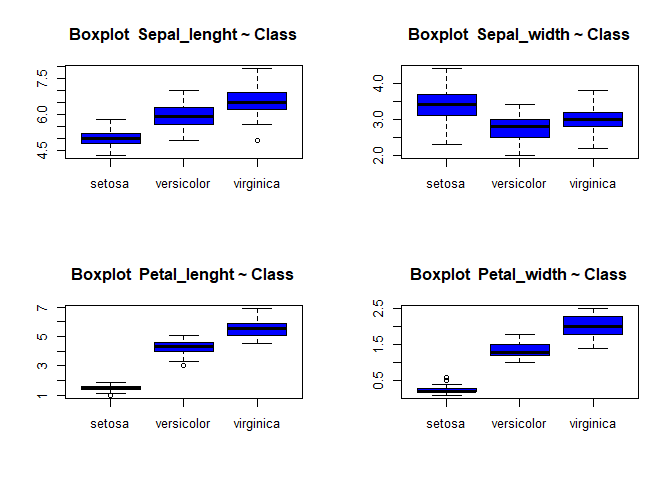
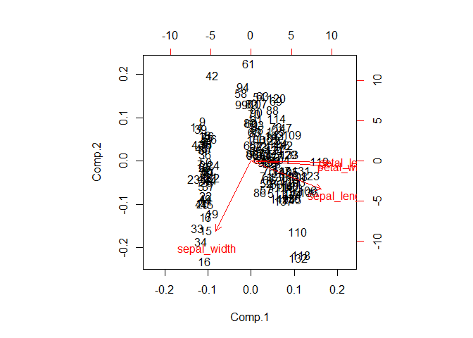
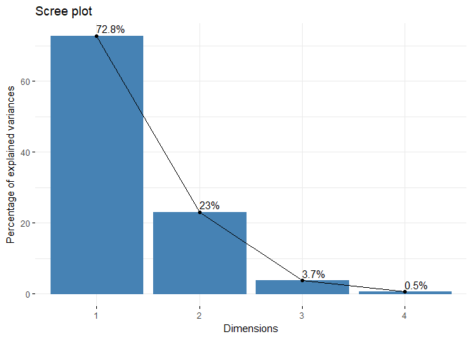
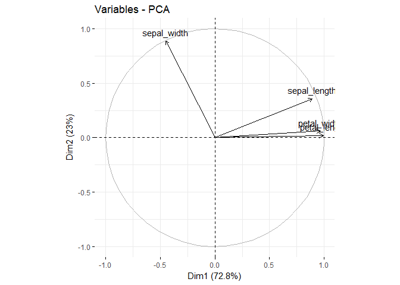
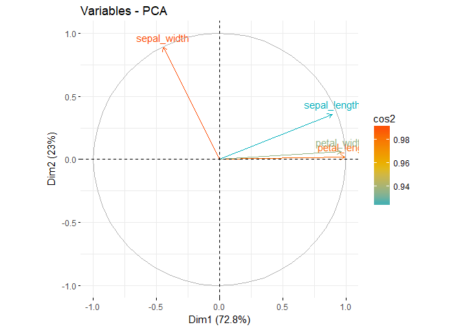
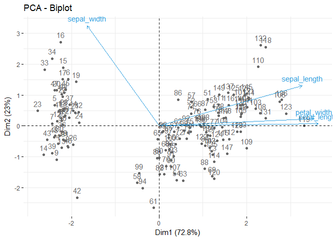
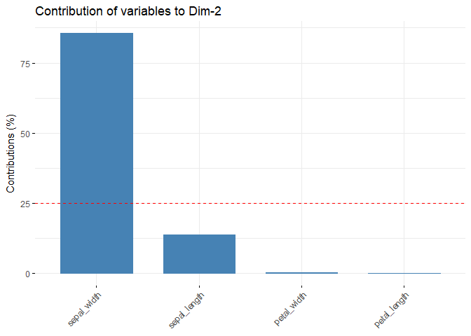
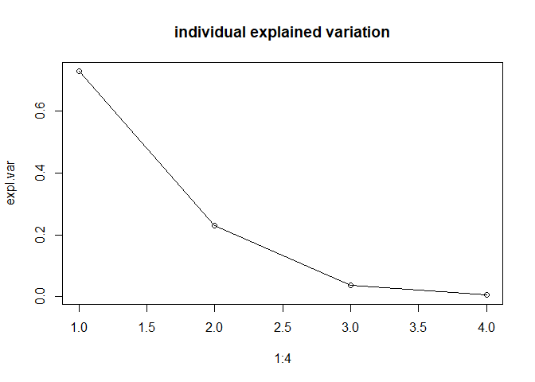
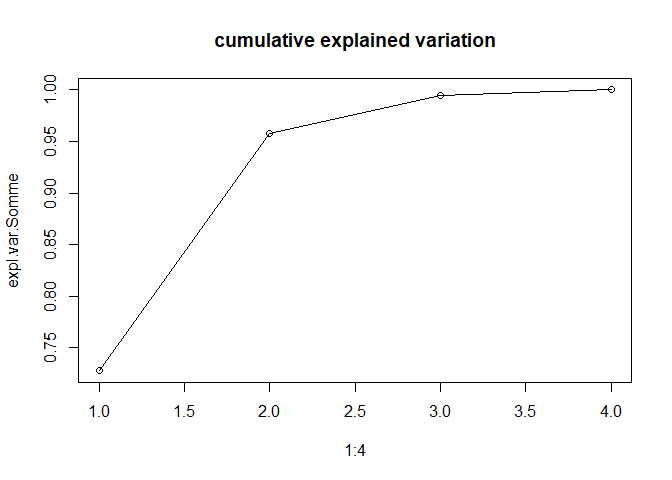

#1. Explore the dataset


```r
iris <- read.table('iris.data', sep =',', header = TRUE)
str(iris)
```

```
## 'data.frame':	150 obs. of  5 variables:
##  $ sepal_length: num  5.1 4.9 4.7 4.6 5 5.4 4.6 5 4.4 4.9 ...
##  $ sepal_width : num  3.5 3 3.2 3.1 3.6 3.9 3.4 3.4 2.9 3.1 ...
##  $ petal_length: num  1.4 1.4 1.3 1.5 1.4 1.7 1.4 1.5 1.4 1.5 ...
##  $ petal_width : num  0.2 0.2 0.2 0.2 0.2 0.4 0.3 0.2 0.2 0.1 ...
##  $ class       : Factor w/ 3 levels "setosa","versicolor",..: 1 1 1 1 1 1 1 1 1 1 ...
```

```r
summary(iris)
```

```
##   sepal_length    sepal_width     petal_length    petal_width   
##  Min.   :4.300   Min.   :2.000   Min.   :1.000   Min.   :0.100  
##  1st Qu.:5.100   1st Qu.:2.800   1st Qu.:1.600   1st Qu.:0.300  
##  Median :5.800   Median :3.000   Median :4.350   Median :1.300  
##  Mean   :5.843   Mean   :3.054   Mean   :3.759   Mean   :1.199  
##  3rd Qu.:6.400   3rd Qu.:3.300   3rd Qu.:5.100   3rd Qu.:1.800  
##  Max.   :7.900   Max.   :4.400   Max.   :6.900   Max.   :2.500  
##         class   
##  setosa    :50  
##  versicolor:50  
##  virginica :50  
##                 
##                 
## 
```

#2. Plot 4 boxplots into the same figure


```r
par(mfrow=c(2,2))

boxplot(iris$sepal_length ~ iris$class , data = iris, col='blue', main = 'Boxplot  Sepal_lenght ~ Class')
boxplot(iris$sepal_width ~ iris$class , data = iris, col='blue', main = 'Boxplot  Sepal_width ~ Class')
boxplot(iris$petal_length ~ iris$class , data = iris, col='blue', main = 'Boxplot  Petal_lenght ~ Class')
boxplot(iris$petal_width ~ iris$class , data = iris, col='blue', main = 'Boxplot  Petal_width ~ Class')
```

<!-- -->


```r
#In ascending order, means of the different flower: Setosa, Versicolor, Virginica for Petal-lenght and Petal_width and Sepal_lenght

#The order is changing for Sepal_width: Versicolor, Virginica, Setosa.

#It's for this last feature (Sepal_width) that Quartiles are quiete closed from eachothers (versicolor, virginica).
```


#3. To explore how the 3 different flower classes are distributed along the 4 different features,
#visualize them via histograms


```r
# Let's use the ggplot2 library
# ggplot2 is the most advanced package for data visualization
# gg corresponds to The Grammar of Graphics.
library(ggplot2)
library(gridExtra)
```

```
## Warning: package 'gridExtra' was built under R version 3.4.4
```

```r
library(cowplot)
```

```
## 
## Attaching package: 'cowplot'
```

```
## The following object is masked from 'package:ggplot2':
## 
##     ggsave
```


```r
# histogram of sepal_length
p1 <- ggplot(iris, aes(x=sepal_length, fill=class)) +  geom_histogram(binwidth=.2, alpha=.5)
# histogram of sepal_width
p2 <- ggplot(iris, aes(x=sepal_width, fill=class)) + geom_histogram(binwidth=.2, alpha=.5)
# histogram of petal_length
p3 <- ggplot(iris, aes(x=petal_length, fill=class)) + geom_histogram(binwidth=.2, alpha=.5)
# histogram of petal_width
p4 <- ggplot(iris, aes(x=petal_width, fill=class)) + geom_histogram(binwidth=.2, alpha=.5)

plot_grid(p1,p2,p3,p4)
```

<!-- -->

#4. Apply a PCA on the Iris iris using the princomp().


```r
pcairis=princomp(iris[,-5], cor=T) 

# Note that we take only the numerical columns to apply PCA.
# now pcairis is a R object of type princomp
```


```r
# To display the internal structure of pcairis
str(pcairis)
```

```
## List of 7
##  $ sdev    : Named num [1:4] 1.706 0.96 0.384 0.144
##   ..- attr(*, "names")= chr [1:4] "Comp.1" "Comp.2" "Comp.3" "Comp.4"
##  $ loadings: loadings [1:4, 1:4] 0.522 -0.263 0.581 0.566 -0.372 ...
##   ..- attr(*, "dimnames")=List of 2
##   .. ..$ : chr [1:4] "sepal_length" "sepal_width" "petal_length" "petal_width"
##   .. ..$ : chr [1:4] "Comp.1" "Comp.2" "Comp.3" "Comp.4"
##  $ center  : Named num [1:4] 5.84 3.05 3.76 1.2
##   ..- attr(*, "names")= chr [1:4] "sepal_length" "sepal_width" "petal_length" "petal_width"
##  $ scale   : Named num [1:4] 0.825 0.432 1.759 0.761
##   ..- attr(*, "names")= chr [1:4] "sepal_length" "sepal_width" "petal_length" "petal_width"
##  $ n.obs   : int 150
##  $ scores  : num [1:150, 1:4] -2.26 -2.09 -2.37 -2.3 -2.39 ...
##   ..- attr(*, "dimnames")=List of 2
##   .. ..$ : NULL
##   .. ..$ : chr [1:4] "Comp.1" "Comp.2" "Comp.3" "Comp.4"
##  $ call    : language princomp(x = iris[, -5], cor = T)
##  - attr(*, "class")= chr "princomp"
```


```r
# To see the variance explained by the the pcs
summary(pcairis) 
```

```
## Importance of components:
##                           Comp.1    Comp.2     Comp.3      Comp.4
## Standard deviation     1.7061120 0.9598025 0.38386622 0.143553848
## Proportion of Variance 0.7277045 0.2303052 0.03683832 0.005151927
## Cumulative Proportion  0.7277045 0.9580098 0.99484807 1.000000000
```

```r
# To plot the variance explained by each pc
plot(pcairis) 
```

<!-- -->


```r
# To plot together the scores for PC1 and PC2 and the 
# variables expressed in terms of PC1 and PC2.
par(mfrow=c(1,1))
biplot(pcairis)
```

<!-- -->

#5. Using factoextra packag plot the following:


```r
library(factoextra)
```

```
## Warning: package 'factoextra' was built under R version 3.4.4
```

```
## Welcome! Related Books: `Practical Guide To Cluster Analysis in R` at https://goo.gl/13EFCZ
```

```r
library("FactoMineR")
```

```
## Warning: package 'FactoMineR' was built under R version 3.4.4
```

```r
res.pca <- PCA(iris[,-5], graph = FALSE)
#The scree plot
fviz_screeplot(res.pca, addlabels = TRUE)
```

<!-- -->

```r
#The graph of individuals
fviz_pca_ind (res.pca, col.ind = "cos2",
              gradient.cols = c("#00AFBB", "#E7B800", "#FC4E07"),
              repel = TRUE # Évite le chevauchement de texte
)
```

<!-- -->

```r
#The graph of variables
fviz_pca_var(res.pca, col.var = "black")
```

<!-- -->

```r
fviz_pca_var(res.pca, col.var = "cos2",
             gradient.cols = c("#00AFBB", "#E7B800", "#FC4E07")
)
```

<!-- -->

```r
#The biplot graph
fviz_pca_biplot(res.pca, repel = FALSE,
                col.var = "#2E9FDF", # Couleur des variables
                col.ind = "#696969"  # Couleur des individues
)
```

<!-- -->

```r
#The contributions of the variables to the first 2 principal components
# Contributions des variables à PC1
fviz_contrib(res.pca, choice = "var", axes = 1, top = 10)
```

<!-- -->

```r
# Contributions des variables à PC2
fviz_contrib(res.pca, choice = "var", axes = 2, top = 10)
```

<!-- -->

##In order to understand how PCA works, let’s implement it step-by-step.

##Summary of the PCA Approach:


```r
# •	Standardize the data

# •	Obtain the Eigenvectors and Eigenvalues from the covariance matrix or correlation matrix.

# •	Sort eigenvalues in descending order and choose the k eigenvectors that correspond to the k largest eigenvalues, where k is the number of dimensions of the new feature subspace (k≤p).
 
# •	Construct the projection matrix A from the selected k eigenvectors.
 
# •	Transform the original dataset X via A to obtain a k-dimensional feature subspace Y.
```

#6. First step, split the iris dataset into data  


```r
X <- iris[,-5]
y <- iris[,5]
```

The iris dataset is now stored in form of a 150×4 matrix where the columns are the different features, and every row represents a separate flower sample.

#Eigendecomposition 

The eigenvectors (principal components) and eigenvalues of a covariance (or correlation) matrix represent the “core” of a PCA
The eigenvectors = the directions of the new feature space.
The eigenvalues = their magnitude (the variance of the data along the new feature axes).

#Standardizing

##7. Scale the 4 features. Store the scaled matrix into a new one (for example, name it X_scaled).


```r
x_scaled <- scale(X)
```

#Covariance Matrix

##8. Compute the Covariance Matrix of the scaled features (Print the results).


```r
segma = cov(x_scaled)
segma
```

```
##              sepal_length sepal_width petal_length petal_width
## sepal_length    1.0000000  -0.1093692    0.8717542   0.8179536
## sepal_width    -0.1093692   1.0000000   -0.4205161  -0.3565441
## petal_length    0.8717542  -0.4205161    1.0000000   0.9627571
## petal_width     0.8179536  -0.3565441    0.9627571   1.0000000
```

##9. Perform an eigendecomposition on the covariance matrix.


```r
eigendecompositionCov = eigen(segma)
eigendecompositionCov
```

```
## eigen() decomposition
## $values
## [1] 2.91081808 0.92122093 0.14735328 0.02060771
## 
## $vectors
##            [,1]        [,2]       [,3]       [,4]
## [1,]  0.5223716 -0.37231836  0.7210168  0.2619956
## [2,] -0.2633549 -0.92555649 -0.2420329 -0.1241348
## [3,]  0.5812540 -0.02109478 -0.1408923 -0.8011543
## [4,]  0.5656110 -0.06541577 -0.6338014  0.5235463
```

#Correlation Matrix

Especially, in the field of “Finance”, the correlation matrix typically used instead of the covariance matrix.

##10. Perform an eigendecomposition of the standardized data based on the correlation matrix.


```r
corr = cor(x_scaled)
eigendecompositionCor = eigen(corr)
```

#11. Perform an eigendecomposition of the raw data based on the correlation matrix.


```r
corrStan = cor(X)
eigendecompositionCorStan = eigen(corrStan)
```

We should see that all three approaches yield the same eigenvectors and eigenvalue
 •	Eigendecomposition of the covariance matrix after standardizing the data.
 •	Eigendecomposition of the correlation matrix.
 •	Eigendecomposition of the correlation matrix after standardizing the data.


#Selecting Principal Components

The eigen() function will, by default, sort the eigenvalues in decreasing order.

#Explained Variance

##12. Calculate the individual explained variation and the cumulative explained variation of each principal component.


```r
expl.var = eigendecompositionCov$values/sum(eigendecompositionCov$values)
expl.var
```

```
## [1] 0.727704521 0.230305233 0.036838320 0.005151927
```

```r
expl.var.Somme = cumsum(expl.var)
```

##13. Plot the individual explained variation. (scree plot)


```r
plot(1:4,expl.var , "o" , main= "individual explained variation")
```

<!-- -->

```r
plot(1:4,expl.var.Somme , "o", main= "cumulative explained variation")
```

<!-- -->

#Projection Matrix

The “projection matrix” is basically just a matrix of our concatenated top k eigenvectors. 
Here, the projection matrix A is a 4×2-dimensional matrix.

##14. Construct the projection matrix that will be used to transform the Iris data onto the new feature subspace.


```r
PM = eigendecompositionCov$vectors[,1:2]
PM
```

```
##            [,1]        [,2]
## [1,]  0.5223716 -0.37231836
## [2,] -0.2633549 -0.92555649
## [3,]  0.5812540 -0.02109478
## [4,]  0.5656110 -0.06541577
```


#Projection Onto the New Feature Space

We will use the 4×2-dimensional projection matrix A to transform our samples (observations) onto the new subspace via the equation Y = X.A where Y is a 150×2 matrix of our transformed samples.

##15. Compute  Y(Recall the Y is the matrix of scores, A is the matrix of loadings).


```r
scores = x_scaled %*% PM
dim(scores)
```

```
## [1] 150   2
```


```r
head(scores)
```

```
##           [,1]       [,2]
## [1,] -2.256981 -0.5040154
## [2,] -2.079459  0.6532164
## [3,] -2.360044  0.3174139
## [4,] -2.296504  0.5734466
## [5,] -2.380802 -0.6725144
## [6,] -2.063623 -1.5134783
```

#Visualization

##16. Plot the observations on the new feature space. Name the axis PC1 and PC2.


```r
plot(scores, xlab='PC1', ylab = 'PC2')
```

<!-- -->

```r
plot(scores, xlab = 'PC1', ylab = 'PC2', col = iris$class)
```

<!-- -->
