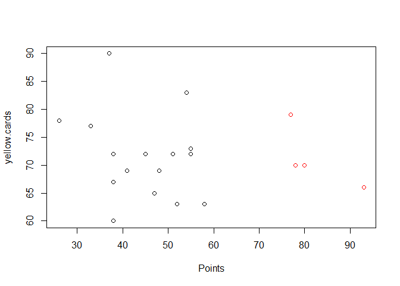
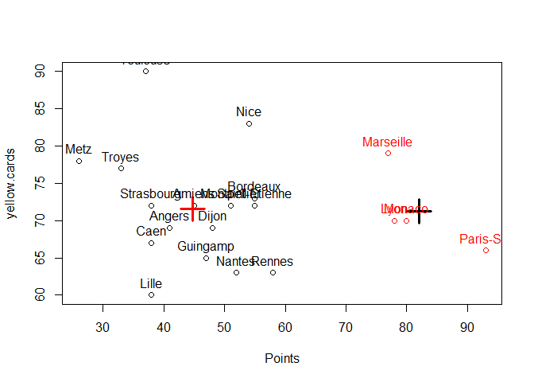
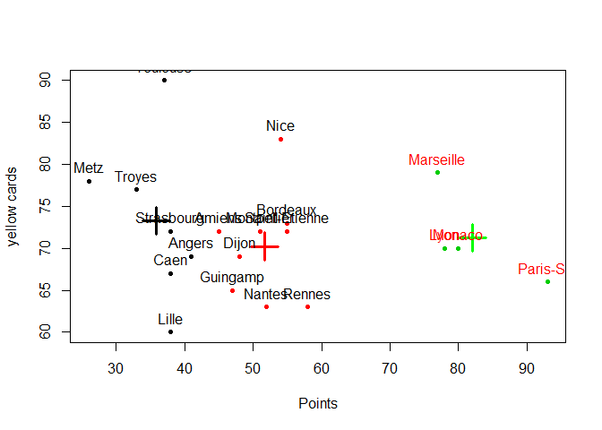
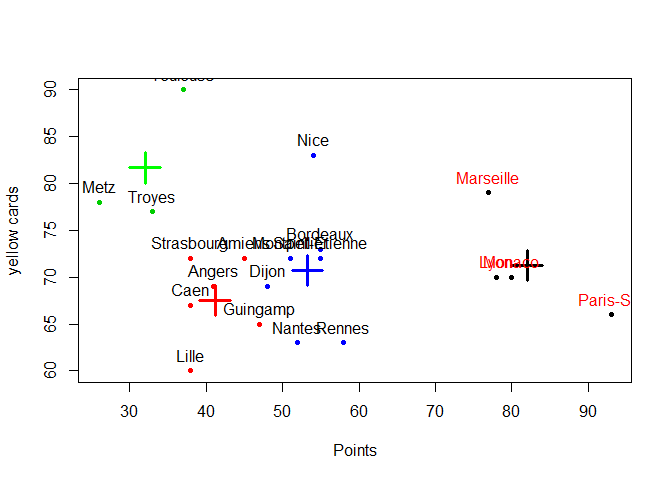
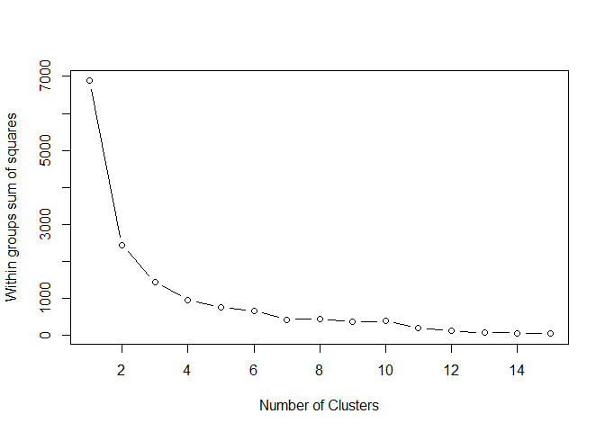
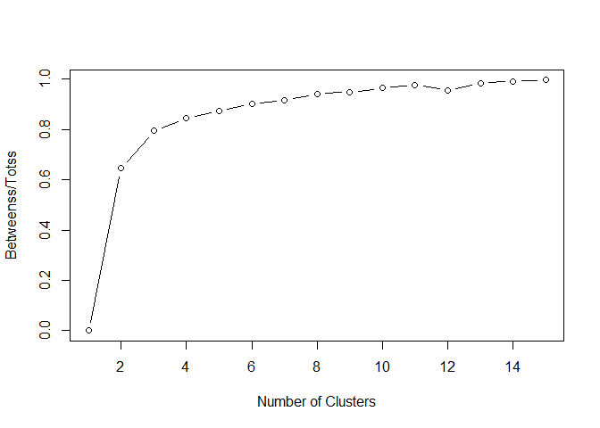
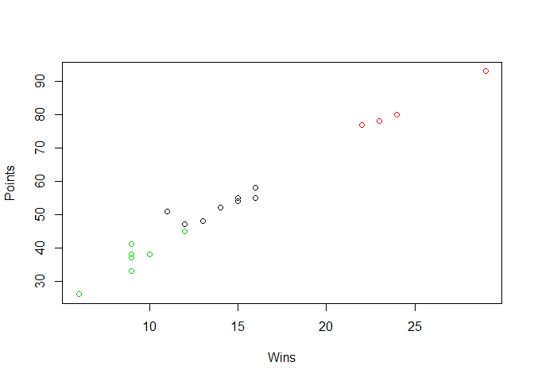
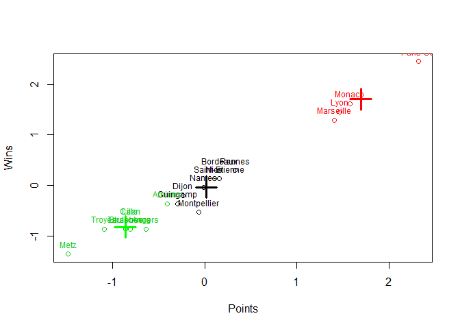

#Exercice 1-2
1. Download the dataset: Ligue1 2017-2018  and import it into R. Put the argument row.names to 1
##Print the first two rows of the dataset and the total number of features in this dataset.


```r
ligue1 <- read.csv("ligue1_17_18.csv", row.names=1, sep=";")
str(ligue1, echo = TRUE)
```

```
## 'data.frame':	20 obs. of  20 variables:
##  $ Points                          : int  93 80 78 77 58 55 55 54 52 51 ...
##  $ Wins                            : int  29 24 23 22 16 16 15 15 14 11 ...
##  $ Draws                           : int  6 8 9 11 10 7 10 9 10 18 ...
##  $ Loses                           : int  3 6 6 5 12 15 13 14 14 9 ...
##  $ Goals.scored                    : int  108 85 87 80 50 53 47 53 36 36 ...
##  $ Goals.conceded                  : int  29 45 43 47 44 48 50 52 41 33 ...
##  $ Difference.goals                : int  79 40 44 33 6 5 -3 1 -5 3 ...
##  $ Points.per.game                 : num  2.45 2.11 2.05 2.03 1.53 1.45 1.45 1.42 1.37 1.34 ...
##  $ red.cards                       : int  6 3 2 3 5 2 8 4 6 1 ...
##  $ yellow.cards                    : int  66 70 70 79 63 73 72 83 63 72 ...
##  $ clean.sheets.percentage         : int  47 37 39 37 26 26 34 26 32 37 ...
##  $ failed.to.score.percentage      : int  8 11 11 8 13 37 26 18 26 32 ...
##  $ shots.per.match.average         : num  16.1 15.7 14.6 12.8 12.5 ...
##  $ shots.on.goal.per.match.average : num  6.74 3.18 6.08 3.66 4.08 4.74 4.74 4.08 4.29 3.97 ...
##  $ ball.possession.per.game.average: num  63.3 57.7 56.4 55.9 52.6 ...
##  $ sum.offside.in.attack           : int  98 93 89 87 86 84 82 78 76 76 ...
##  $ sum.offside.in.defense          : int  99 90 76 68 57 39 51 50 71 60 ...
##  $ corners.per.game.average        : num  6.71 6.39 5.74 5.34 5.32 5.13 4.87 4.87 4.82 4.79 ...
##  $ fouls.for.sum                   : int  139 115 114 112 110 109 108 108 105 104 ...
##  $ fouls.against.sum               : int  105 112 107 85 117 109 96 85 122 111 ...
```

```r
knitr::kable(ligue1[1:2,1:20])
```

            Points   Wins   Draws   Loses   Goals.scored   Goals.conceded   Difference.goals   Points.per.game   red.cards   yellow.cards   clean.sheets.percentage   failed.to.score.percentage   shots.per.match.average   shots.on.goal.per.match.average   ball.possession.per.game.average   sum.offside.in.attack   sum.offside.in.defense   corners.per.game.average   fouls.for.sum   fouls.against.sum
---------  -------  -----  ------  ------  -------------  ---------------  -----------------  ----------------  ----------  -------------  ------------------------  ---------------------------  ------------------------  --------------------------------  ---------------------------------  ----------------------  -----------------------  -------------------------  --------------  ------------------
Paris-SG        93     29       6       3            108               29                 79              2.45           6             66                        47                            8                     16.05                              6.74                              63.34                      98                       99                       6.71             139                 105
Monaco          80     24       8       6             85               45                 40              2.11           3             70                        37                           11                     15.68                              3.18                              57.68                      93                       90                       6.39             115                 112

#Exercice 3
##Let's take in consideration only Points and the Yellow cards of each team


```r
pointCards =(ligue1[,c(1,10)])
pointCards
```

```
##               Points yellow.cards
## Paris-SG          93           66
## Monaco            80           70
## Lyon              78           70
## Marseille         77           79
## Rennes            58           63
## Bordeaux          55           73
## Saint-Etienne     55           72
## Nice              54           83
## Nantes            52           63
## Montpellier       51           72
## Dijon             48           69
## Guingamp          47           65
## Amiens            45           72
## Angers            41           69
## Strasbourg        38           72
## Caen              38           67
## Lille             38           60
## Toulouse          37           90
## Troyes            33           77
## Metz              26           78
```

#Exercice 4
##Let's apply k-means on pointsCards. 


```r
set.seed(101)
km <- kmeans(pointCards,centers=2, iter.max =20)
```

#Exercice 5 

##Now we are going to print and describe the results of km.


```r
print(km)
```

```
## K-means clustering with 2 clusters of sizes 16, 4
## 
## Cluster means:
##   Points yellow.cards
## 1  44.75      71.5625
## 2  82.00      71.2500
## 
## Clustering vector:
##      Paris-SG        Monaco          Lyon     Marseille        Rennes 
##             2             2             2             2             1 
##      Bordeaux Saint-Etienne          Nice        Nantes   Montpellier 
##             1             1             1             1             1 
##         Dijon      Guingamp        Amiens        Angers    Strasbourg 
##             1             1             1             1             1 
##          Caen         Lille      Toulouse        Troyes          Metz 
##             1             1             1             1             1 
## 
## Within cluster sum of squares by cluster:
## [1] 2180.938  256.750
##  (between_SS / total_SS =  64.6 %)
## 
## Available components:
## 
## [1] "cluster"      "centers"      "totss"        "withinss"    
## [5] "tot.withinss" "betweenss"    "size"         "iter"        
## [9] "ifault"
```

In this cluster, we can see there are 2 centers and the ration (between_SS / total_SS) =  64.6 %.
Higher the % is, better the number K of cluster is matching

#Exercice 6 
What are the coordinates of the centers of the clusters (called also prototypes or centroids) ?

```r
km$centers
```

```
##   Points yellow.cards
## 1  44.75      71.5625
## 2  82.00      71.2500
```
#Exericie 7 
Plot the data (Yellow.cards vs Points). Color the points corresponding to their cluster.

```r
km$cluster
```

```
##      Paris-SG        Monaco          Lyon     Marseille        Rennes 
##             2             2             2             2             1 
##      Bordeaux Saint-Etienne          Nice        Nantes   Montpellier 
##             1             1             1             1             1 
##         Dijon      Guingamp        Amiens        Angers    Strasbourg 
##             1             1             1             1             1 
##          Caen         Lille      Toulouse        Troyes          Metz 
##             1             1             1             1             1
```

```r
plot(pointCards, col=km$cluster)
```

<!-- -->

#Exercice 8 
Add to the previous plot the clusters centroids and add the names of the observations.

```r
plot(pointCards, col=km$cluster)
points(km$centers, col=c("red","black"),pch=3, cex=3, lwd=3)
text(x=pointCards,labels = rownames(pointCards), col=km$cluster, pos=3,cex=1)
```

<!-- -->

#Exercice 9. 
##K-means using K=3, K=4
Re-run  k-means on pointsCards using 3 and 4 clusters and store the results into km3 and km4 respectively. Visualize the results like in question 7 and 8.

```r
km3 <- kmeans(pointCards,centers=3, iter.max =20)
km4 <- kmeans(pointCards,centers=4, iter.max =20)
```
Visualization

###3 Clusters

```r
plot(pointCards, col=km3$cluster, ylab="yellow cards", pch =20)
points(km3$centers, pch=3, cex=3, lwd=3 ,col=c('black','red','green'))
text(x=pointCards,labels = rownames(pointCards), col=km$cluster, pos=3,cex=1)
```

<!-- -->

###4 Clusters

```r
plot(pointCards, col=km4$cluster, ylab="yellow cards", pch =20)
points(km4$centers,  pch=3, cex=3, lwd=3 ,col=c('black','red','green','blue'))
text(x=pointCards,labels = rownames(pointCards), col=km$cluster, pos=3,cex=1)
```

<!-- -->

#Exercice 10
##Visualize the "within groups sum of squares" of the k-means clustering results

```r
mydata <- pointCards
wss <- (nrow(mydata)-1)*sum(apply(mydata,2,var)) #variance k=0
for (i in 2:15) wss[i] <- sum(kmeans(mydata,
                                       centers=i)$withinss)
plot(1:15, wss, type="b", xlab="Number of Clusters",
     ylab="Within groups sum of squares")
```

<!-- -->
#Exercice 11
##Visualize the 'between_SS / total_SS'

```r
mydata <- pointCards
ratio <- 0
for (i in 1:15) ratio[i] <- kmeans(pointCards, centers = i)$betweenss/kmeans(pointCards, centers = i)$totss
plot(1:15, ratio, type="b", xlab="Number of Clusters",
     ylab="Betweenss/Totss")
```

<!-- -->

```r
ratio2clusters = signif(km$betweenss/km$totss,2)
ratio3clusters = signif(km3$betweenss/km3$totss,2)
ratio4clusters = signif(km4$betweenss/km4$totss,2)

ratio2clusters
```

```
## [1] 0.65
```

```r
ratio3clusters
```

```
## [1] 0.79
```

```r
ratio4clusters
```

```
## [1] 0.86
```
#Exercice 12
##Scale the dataset and transform it to a data frame again.

```r
ligue1_scaled=scale(ligue1)
ligue1_scaled
```

```
##                    Points       Wins      Draws       Loses Goals.scored
## Paris-SG       2.31822909  2.4502435 -1.3224461 -1.88719535    2.6102823
## Monaco         1.57957766  1.6224585 -0.5877538 -1.38169659    1.5448609
## Lyon           1.46593898  1.4569015 -0.2204077 -1.38169659    1.6375063
## Marseille      1.40911964  1.2913445  0.5142846 -1.55019618    1.3132476
## Rennes         0.32955217  0.2980026  0.1469385 -0.37069909   -0.0764324
## Bordeaux       0.15909415  0.2980026 -0.9550999  0.13479967    0.0625356
## Saint-Etienne  0.15909415  0.1324456  0.1469385 -0.20219950   -0.2154004
## Nice           0.10227481  0.1324456 -0.2204077 -0.03369992    0.0625356
## Nantes        -0.01136387 -0.0331114  0.1469385 -0.03369992   -0.7249497
## Montpellier   -0.06818321 -0.5297824  3.0857075 -0.87619784   -0.7249497
## Dijon         -0.23864123 -0.1986684 -0.2204077  0.30329925    0.1551809
## Guingamp      -0.29546057 -0.3642254  0.5142846  0.13479967   -0.1690777
## Amiens        -0.40909925 -0.3642254 -0.2204077  0.47179884   -0.6786271
## Angers        -0.63637661 -0.8608964  1.6163230  0.13479967   -0.4470137
## Strasbourg    -0.80683463 -0.8608964  0.5142846  0.64029842   -0.3543684
## Caen          -0.80683463 -0.6953394 -0.5877538  0.97729759   -1.1418537
## Lille         -0.80683463 -0.6953394 -0.5877538  0.97729759   -0.4933364
## Toulouse      -0.86365397 -0.8608964  0.1469385  0.80879801   -0.6323044
## Troyes        -1.09093133 -0.8608964 -1.3224461  1.48279634   -0.9102404
## Metz          -1.48866672 -1.3575673 -0.5877538  1.65129593   -0.8175951
##               Goals.conceded Difference.goals Points.per.game  red.cards
## Paris-SG         -1.82814355       2.71219789     2.316459363  0.8720816
## Monaco           -0.53673972       1.37326475     1.584492649 -0.6668859
## Lyon             -0.69816520       1.51059123     1.455322053 -1.1798751
## Marseille        -0.37531424       1.13294342     1.412265188 -0.6668859
## Rennes           -0.61745246       0.20598971     0.335843551  0.3590924
## Bordeaux         -0.29460150       0.17165809     0.163616089 -1.1798751
## Saint-Etienne    -0.13317602      -0.10299486     0.163616089  1.8980600
## Nice              0.02824946       0.03433162     0.099030791 -0.1538968
## Nantes           -0.85959067      -0.17165809    -0.008611373  0.8720816
## Montpellier      -1.50529259       0.10299486    -0.073196671 -1.6928643
## Dijon             1.72321699      -0.61796914    -0.245424133  0.3590924
## Guingamp          0.59323863      -0.37764781    -0.288480999 -1.1798751
## Amiens           -0.77887793      -0.17165809    -0.417651595  0.3590924
## Angers            0.02824946      -0.34331619    -0.632935922 -0.6668859
## Strasbourg        1.23894055      -0.78962723    -0.805163384 -0.1538968
## Caen              0.02824946      -0.85829047    -0.805163384 -0.1538968
## Lille             1.23894055      -0.89262209    -0.805163384  0.8720816
## Toulouse          0.18967494      -0.54930590    -0.869748683 -0.6668859
## Troyes            0.59323863      -0.92695371    -1.085033010  1.3850708
## Metz              1.96535520      -1.44192799    -1.494073232  1.3850708
##               yellow.cards clean.sheets.percentage
## Paris-SG       -0.76079012               1.8731961
## Monaco         -0.20748822               0.9125827
## Lyon           -0.20748822               1.1047054
## Marseille       1.03744108               0.9125827
## Rennes         -1.17576655              -0.1440920
## Bordeaux        0.20748822              -0.1440920
## Saint-Etienne   0.06916274               0.6243987
## Nice            1.59074298              -0.1440920
## Nantes         -1.17576655               0.4322760
## Montpellier     0.06916274               0.9125827
## Dijon          -0.34581369              -1.3928894
## Guingamp       -0.89911560               0.1440920
## Amiens          0.06916274               0.1440920
## Angers         -0.34581369              -1.1047054
## Strasbourg      0.06916274              -1.5850121
## Caen           -0.62246465               0.6243987
## Lille          -1.59074298              -1.3928894
## Toulouse        2.55902132               0.4322760
## Troyes          0.76079012              -0.6243987
## Metz            0.89911560              -1.5850121
##               failed.to.score.percentage shots.per.match.average
## Paris-SG                      -1.5205232            2.3000010825
## Monaco                        -1.2871948            2.0924906215
## Lyon                          -1.2871948            1.4587424569
## Marseille                     -1.5205232            0.4716656694
## Rennes                        -1.1316426            0.2921971626
## Bordeaux                       0.7349844            0.2192880818
## Saint-Etienne                 -0.1205530            0.1632041734
## Nice                          -0.7427620            0.0005608391
## Nantes                        -0.1205530           -0.0443062876
## Montpellier                    0.3461037           -0.1620824952
## Dijon                         -0.7427620           -0.1789076677
## Guingamp                       0.1127754           -0.3135090478
## Amiens                         1.1238650           -0.3527677837
## Angers                         0.3461037           -0.4144600829
## Strasbourg                     0.7349844           -0.5490614630
## Caen                           1.5127456           -0.5602782447
## Lille                          0.7349844           -0.5771034172
## Toulouse                       0.3461037           -0.7117047973
## Troyes                         1.3571933           -1.5529634230
## Metz                           1.1238650           -1.5810053771
##               shots.on.goal.per.match.average
## Paris-SG                           2.82721658
## Monaco                            -1.11747910
## Lyon                               2.09589659
## Marseille                         -0.58561002
## Rennes                            -0.12022457
## Bordeaux                           0.61109541
## Saint-Etienne                      0.61109541
## Nice                              -0.12022457
## Nantes                             0.11246815
## Montpellier                       -0.24211124
## Dijon                             -0.76289971
## Guingamp                           0.37840269
## Amiens                            -0.60777123
## Angers                            -0.08698276
## Strasbourg                        -0.38615911
## Caen                               0.11246815
## Lille                             -0.33075608
## Toulouse                          -0.06482154
## Troyes                            -1.38341364
## Metz                              -0.94018941
##               ball.possession.per.game.average sum.offside.in.attack
## Paris-SG                             2.5183827            1.87323185
## Monaco                               1.4509837            1.45038042
## Lyon                                 1.2039355            1.11209927
## Marseille                            1.1134141            0.94295870
## Rennes                               0.4910790            0.85838841
## Bordeaux                             0.3345523            0.68924784
## Saint-Etienne                        0.2006559            0.52010726
## Nice                                 0.1912266            0.18182612
## Nantes                               0.1308790            0.01268554
## Montpellier                          0.1025910            0.01268554
## Dijon                               -0.1218268           -0.07188474
## Guingamp                            -0.2877828           -0.07188474
## Amiens                              -0.4895703           -0.32559560
## Angers                              -0.6781567           -0.41016589
## Strasbourg                          -0.7309609           -0.41016589
## Caen                                -0.7931944           -0.49473618
## Lille                               -1.0364708           -1.00215790
## Toulouse                            -1.0553295           -1.42500933
## Troyes                              -1.1722530           -1.50957962
## Metz                                -1.3721546           -1.93243105
##               sum.offside.in.defense corners.per.game.average
## Paris-SG                 0.869044021               2.47117334
## Monaco                   0.531186734               2.03560437
## Lyon                     0.005630955               1.15085489
## Marseille               -0.294686634               0.60639368
## Rennes                  -0.707623317               0.57917062
## Bordeaux                -1.383337891               0.32055154
## Saint-Etienne           -0.932861509              -0.03334825
## Nice                    -0.970401207              -0.03334825
## Nantes                  -0.182067538              -0.10140590
## Montpellier             -0.595004222              -0.14224049
## Dijon                   -0.820242413              -0.25113274
## Guingamp                -0.857782112              -0.29196733
## Amiens                   2.558330455              -0.31919039
## Angers                   0.305948543              -0.36002498
## Strasbourg              -0.219607236              -0.46891722
## Caen                     0.418567639              -0.60503252
## Lille                   -0.482385126              -0.75475936
## Toulouse                 1.920155580              -0.93170925
## Troyes                  -0.182067538              -1.25838598
## Metz                     1.019202815              -1.61228577
##               fouls.for.sum fouls.against.sum
## Paris-SG         2.90553106        0.12519923
## Monaco           0.96040567        0.58645957
## Lyon             0.87935877        0.25698790
## Marseille        0.71726499       -1.19268743
## Rennes           0.55517121        0.91593123
## Bordeaux         0.47412432        0.38877657
## Saint-Etienne    0.39307742       -0.46784977
## Nice             0.39307742       -1.19268743
## Nantes           0.14993675        1.24540290
## Montpellier      0.06888986        0.52056523
## Dijon           -0.09320393        1.64076890
## Guingamp        -0.33634460       -1.06089877
## Amiens          -0.41739149       -0.07248377
## Angers          -0.57948528       -1.78573643
## Strasbourg      -0.66053217       -0.40195543
## Caen            -0.74157906        0.78414257
## Lille           -0.90367284        0.38877657
## Toulouse        -0.98471973       -1.52215910
## Troyes          -1.06576662       -0.59963843
## Metz            -1.71414176        1.44308590
## attr(,"scaled:center")
##                           Points                             Wins 
##                          52.2000                          14.2000 
##                            Draws                            Loses 
##                           9.6000                          14.2000 
##                     Goals.scored                   Goals.conceded 
##                          51.6500                          51.6500 
##                 Difference.goals                  Points.per.game 
##                           0.0000                           1.3740 
##                        red.cards                     yellow.cards 
##                           4.3000                          71.5000 
##          clean.sheets.percentage       failed.to.score.percentage 
##                          27.5000                          27.5500 
##          shots.per.match.average  shots.on.goal.per.match.average 
##                          11.9490                           4.1885 
## ball.possession.per.game.average            sum.offside.in.attack 
##                          49.9860                          75.8500 
##           sum.offside.in.defense         corners.per.game.average 
##                          75.8500                           4.8945 
##                    fouls.for.sum                fouls.against.sum 
##                         103.1500                         103.1000 
## attr(,"scaled:scale")
##                           Points                             Wins 
##                       17.5996411                        6.0402161 
##                            Draws                            Loses 
##                        2.7222282                        5.9347327 
##                     Goals.scored                   Goals.conceded 
##                       21.5877036                       12.3896179 
##                 Difference.goals                  Points.per.game 
##                       29.1276682                        0.4645020 
##                        red.cards                     yellow.cards 
##                        1.9493589                        7.2293262 
##          clean.sheets.percentage       failed.to.score.percentage 
##                       10.4100154                       12.8574165 
##          shots.per.match.average  shots.on.goal.per.match.average 
##                        1.7830426                        0.9024777 
## ball.possession.per.game.average            sum.offside.in.attack 
##                        5.3026095                       11.8244840 
##           sum.offside.in.defense         corners.per.game.average 
##                       26.6384664                        0.7346712 
##                    fouls.for.sum                fouls.against.sum 
##                       12.3385361                       15.1758118
```
#Exercice 13
##K-means on ligue1 and on ligue1_scaled

```r
set.seed(101)
km.ligue1=kmeans(ligue1,center=3,iter.max = 20)
plot(ligue1$Wins,ligue1$Points, col=km.ligue1$cluster, xlab = 'Wins', ylab = 'Points')
text(x=ligue1,labels=rownames(ligue1),col=km.ligue1$cluster,pos=3,cex = 0.75)
```

<!-- -->


```r
set.seed(101)
km.ligue1.scaled=kmeans(ligue1_scaled,center=3,iter.max = 20)
plot(ligue1_scaled,col=km.ligue1.scaled$cluster)
points(km.ligue1.scaled$centers,col=c("black","red","green"),pch=3,cex=3,lwd=3)
text(x=ligue1_scaled,labels=rownames(ligue1_scaled),col=km.ligue1.scaled$cluster,pos=3,cex = 0.75)
```

<!-- -->
