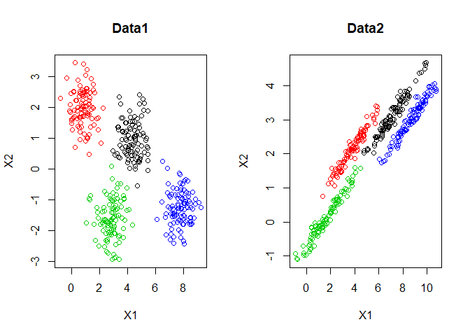
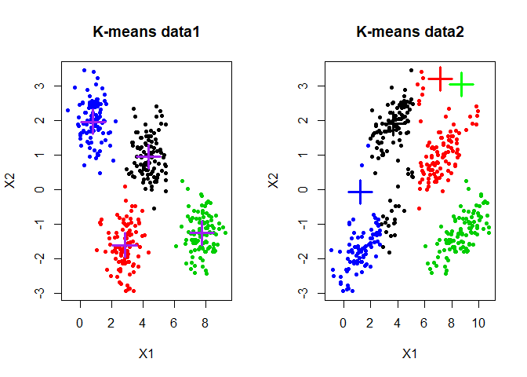
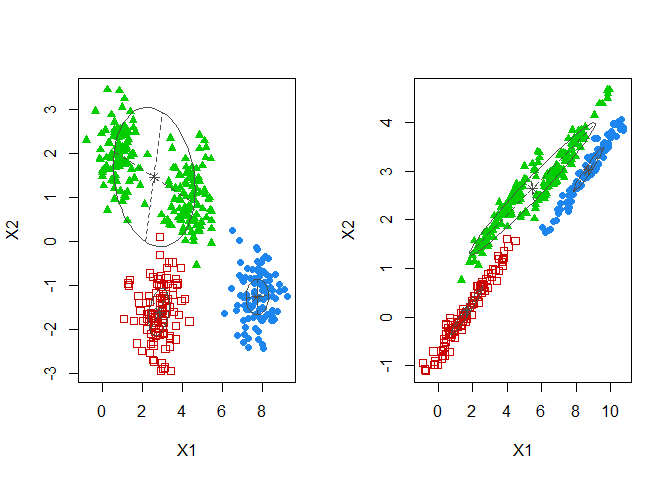
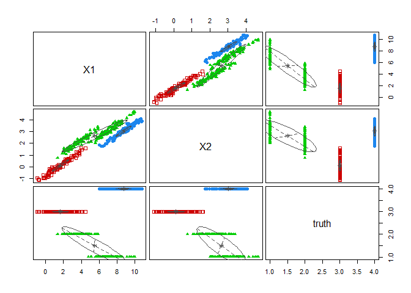
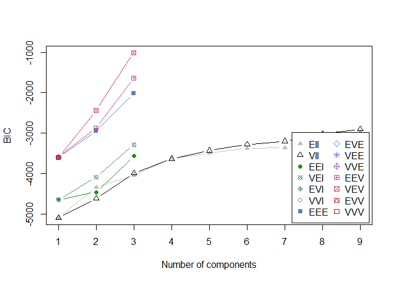
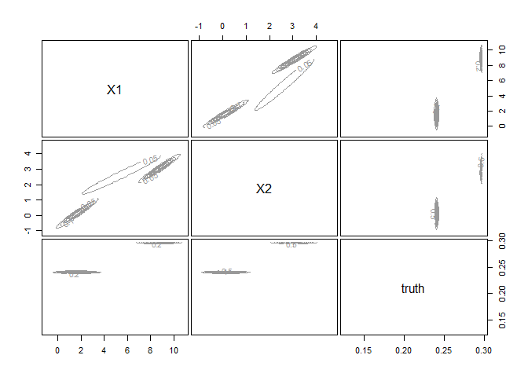
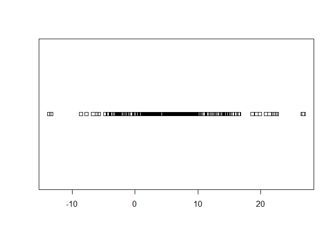
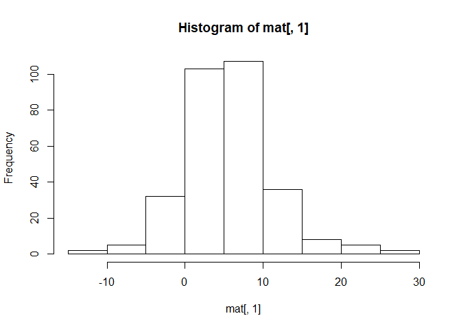

#EM using mclust
#GMM vs k-means

##1. Download and import Data1  and Data2 . Plot both of the datasets on the same window. Color the observations with respect to the ground truth

```r
data1 <- read.csv("data1.csv", sep=",")
str(data1)
```

```
## 'data.frame':	400 obs. of  3 variables:
##  $ X1   : num  6.49 2.52 3.07 4.31 2.38 ...
##  $ X2   : num  0.25 -2.698 -2.9 0.703 -2.536 ...
##  $ truth: int  4 3 3 1 3 4 2 1 3 2 ...
```

```r
data2 <- read.csv("data2.csv", sep=",")
str(data2)
```

```
## 'data.frame':	400 obs. of  3 variables:
##  $ X1   : num  9.065 -0.251 0.212 6.752 -0.216 ...
##  $ X2   : num  3.669 -0.981 -0.864 2.902 -0.914 ...
##  $ truth: int  4 3 3 1 3 4 2 1 3 2 ...
```


```r
par(mfrow=c(1,2))
plot(data1$X1,data1$X2, xlab='X1', ylab='X2', col = data1$truth, main = "Data1")
plot(data2$X1,data2$X2, xlab='X1', ylab='X2', col = data2$truth, main = "Data2")
```

<!-- -->

##2. Apply  
k-means on both datasets with 4 clusters. Plot both of the dataset on the same window and color the observations with respect to k-means results. Interpret the results.


```r
set.seed(211528)
km1 <- kmeans(data1,centers=4, iter.max =20)
km2 <- kmeans(data2,centers=4, iter.max =20)

par(mfrow=c(1,2))
plot(data1$X1, data1$X2, col=km1$cluster, xlab='X1', ylab='X2',pch =20, main = 'K-means data1')
points(km1$centers,  pch=3, cex=3, lwd=3 ,col='purple')

plot(data2$X1, data1$X2, col=km2$cluster, xlab='X1', ylab='X2', pch =20, main = 'K-means data2')
points(km2$centers,  pch=3, cex=3, lwd=3 ,col=c('black','red','green','blue'))
```

<!-- -->
The first K-mean plot on data1 is pretty accurate because the original values have a circle-shape. However, the second K-mean on data2 is not working well because data are more linear. We can see some clusters overlapped eachothers.


##3. Now fit a GMM model on the datasets.


```r
library(mclust)
```

```
## Warning: package 'mclust' was built under R version 3.4.4
```

```
## Package 'mclust' version 5.4.2
## Type 'citation("mclust")' for citing this R package in publications.
```

```r
#help("mclust")
gmm_model1 <- Mclust(data1)
summary(gmm_model1)
```

```
## ---------------------------------------------------- 
## Gaussian finite mixture model fitted by EM algorithm 
## ---------------------------------------------------- 
## 
## Mclust VEV (ellipsoidal, equal shape) model with 3 components: 
## 
##  log.likelihood   n df       BIC       ICL
##       -911.8512 400 25 -1973.489 -1973.489
## 
## Clustering table:
##   1   2   3 
## 100 100 200
```

```r
gmm_model2 <- Mclust(data2)
summary(gmm_model2)
```

```
## ---------------------------------------------------- 
## Gaussian finite mixture model fitted by EM algorithm 
## ---------------------------------------------------- 
## 
## Mclust VEV (ellipsoidal, equal shape) model with 3 components: 
## 
##  log.likelihood   n df       BIC       ICL
##       -430.4727 400 25 -1010.732 -1010.732
## 
## Clustering table:
##   1   2   3 
## 100 100 200
```
Visualize the results on both of the datasets

```r
par(mfrow=c(1,2))
plot(gmm_model1, dimens=c(1,2) ,what = 'classification')
plot(gmm_model2, dimens=c(1,2),what = 'classification')
```

<!-- -->
The results show that for the first plot the GGM model merge 2 clusters, the first GGM model has now only 3 clusters. We can still see the circle shape of the clusters. 
The plot of the data2 become more interesting thanks to the ggm model. We can see there is no more overlapping. The model fit more the data by having elipsoidal shape. 


##4. Show the summary of the GMM model you fitted on Data2. Explain what it shows.

```r
summary(gmm_model2)
```

```
## ---------------------------------------------------- 
## Gaussian finite mixture model fitted by EM algorithm 
## ---------------------------------------------------- 
## 
## Mclust VEV (ellipsoidal, equal shape) model with 3 components: 
## 
##  log.likelihood   n df       BIC       ICL
##       -430.4727 400 25 -1010.732 -1010.732
## 
## Clustering table:
##   1   2   3 
## 100 100 200
```
The clustering table shows the size of each cluster. We can see the log likelihood use in Expectation-Maximization (EM) algorithm. n is the number of data. df, degree of freedom.
Bic is use to know which model is the best performing.

##5. Apply the following code, given that the model is named gmm_model, and interpret what it shows.

```r
plot(gmm_model2, what = "classification")
```

<!-- -->

```r
plot(gmm_model2, what = "uncertainty")
```

<!-- -->


##6.Values of BIC for different number of mixtures

```r
plot(gmm_model2, what = "BIC")
```

<!-- -->
The model that maximise BIC is VEV

##7.A density estimate based on GMM can be obtained using the function densityMclust()

```r
density <- densityMclust(data2)
summary(density)
```

```
## ------------------------------------------------------- 
## Density estimation via Gaussian finite mixture modeling 
## ------------------------------------------------------- 
## 
## Mclust VEV (ellipsoidal, equal shape) model with 3 components: 
## 
##  log.likelihood   n df       BIC       ICL
##       -430.4727 400 25 -1010.732 -1010.732
## 
## Clustering table:
##   1   2   3 
## 100 100 200
```

```r
plot(gmm_model2, what = 'density')
```

<!-- -->

#EM on 1D
In this part you must fit a GMM model on a one dimensional simulated data

##8. Create a data table of 300 observations
The first column contains generated data. Those data are generated from three Gaussian distributions with different parameters.
The second column corresponds to the groud truth (every observation was generated from which Gaussian).
Hint: functions you may need are rnorm(), rep(), rbind() or cbind().
You must of course set a seed (your sutdent_pk).

First column

```r
set.seed(211528)
#help(rbind)
g1 <- rnorm(100, mean = 3, sd=5)
g2 <- rnorm(100, mean = 5, sd=3)
g3 <- rnorm(100, mean = 8, sd=8)
gauss <- c(g1,g2,g3)
gauss 
```

```
##   [1]  -4.70628148   5.53171275   1.49237531   7.63913436  10.08343463
##   [6]   5.84514890   4.00660824   7.80678066   4.36919119   1.81439201
##  [11]   0.29928834  -1.49795630   3.32703802   7.76339436   4.73678472
##  [16]   3.20000344  -0.03532663  -3.83026756  -1.59541582   0.41061030
##  [21]  12.87701427   3.64068188   1.67987673   7.27897102   4.20341687
##  [26]  11.75649310   7.01901273   1.61124181   0.39413629  -1.42772490
##  [31]  -2.48856184   1.40798795  -2.75076990   1.20943123  -0.66780388
##  [36]   0.39771568   8.42652114   5.90463571  -2.87789720   4.21573806
##  [41]   6.95056828  -0.57163126   5.03954811  12.50133649   2.40960896
##  [46]  -6.67078810   1.90229408   4.63010603   3.85511133   4.31148929
##  [51]   6.94013330   4.21768886   4.66047958  -3.63287213   7.46487869
##  [56]  -3.30773669  -2.92606434   2.16045501   1.82434232   3.70734774
##  [61]   6.30940538   9.96776180   5.09718220 -13.36318940   7.73983856
##  [66]  -3.79007297  -4.32414785   6.43870084   2.18031034  -5.77886338
##  [71]   2.17710168   1.21623906   7.34734621   3.06541270  -4.27018894
##  [76]  -3.86323451   1.06784136   6.07428818  -2.78771616   7.60988855
##  [81]   5.68015287   4.08665072   1.04668850   4.57615245  -0.48843825
##  [86]   7.10850986   8.13616054   5.57753385   2.62647659  -1.95371058
##  [91]   3.03291092   4.87521092   3.34821234   7.93244558  -2.62048510
##  [96]   1.81364512   8.69126574   2.18044031   1.28427253  11.66752609
## [101]   4.29012495   5.30740272   4.68665002   3.56433910   1.33446593
## [106]   1.84138672   0.39834174   6.32540664   8.00920014   6.94168508
## [111]   3.06712489   6.19599558   2.19909042   4.22236009   6.07275500
## [116]   8.83291947   5.80563388   7.76998546   6.63332712   3.07918259
## [121]   0.96747982   9.94119678   9.33341738   1.00782273   0.45514786
## [126]  -2.69893886   1.70120950   4.60002456   3.63414310   7.16181163
## [131]   2.95053758   4.66579800   7.18833013   7.23103908   3.69264351
## [136]   9.39857168   4.77908196   5.14547117   9.67333726   5.66885751
## [141]   8.53324258   4.20075768   7.19976469   6.60532726   4.95323950
## [146]  -2.43431101  -2.27063414   4.88955002   7.47214539   7.66239604
## [151]   5.50924335   6.86700048   0.79862249   5.62793656   4.96281106
## [156]  12.35142095   1.26591995  -0.58245574   4.40028428   9.36367516
## [161]   6.49956723   6.17924156   6.07108834   2.64186248   6.19084573
## [166]   4.82210401   2.62096695  10.04511300   7.18341955  10.15575595
## [171]   4.98320291   2.00348676   9.93713308   3.75680580   8.42109404
## [176]   5.16049584   1.26873769   4.06011607   6.09088218  11.37796440
## [181]   3.01844756   8.48651398   0.76359696   2.23466342   2.21434222
## [186]   6.86342324   3.46591976   3.79602148   9.05096552   3.65812292
## [191]   2.88709941   5.79496139   6.28123934   8.58925620   9.06652943
## [196]   7.65444601   1.24996695   6.01153490   8.16651582   6.13352990
## [201]  14.78372842  -1.22661087   8.80604518   8.03291349   1.98412998
## [206]  14.45114266  14.00403730   6.12420421  10.86077727  -2.57852733
## [211]  26.66608410   7.88883331   6.46793514  -7.71911909  16.11394569
## [216]  22.35849142  16.55095891  14.90106135  11.75988857  19.84946490
## [221]   6.19905325  26.84803423   1.04612832  20.81387077  16.50096168
## [226]  13.87650486   7.02045054   0.02236051   9.14691962   9.16637970
## [231]  15.57299154  22.54844286  10.90197684   1.84830995  -1.40846079
## [236]  19.34151268   0.91339187   5.53445005   7.11654863   7.91800538
## [241]  14.57112678  21.40771007   3.18588673  15.17800303   8.46167766
## [246]   4.18724040  13.13211950   3.48945924  14.36299087   5.10123827
## [251]  10.27452227  13.69192293   8.66576517  10.25478207  22.11847519
## [256]  18.70307431   8.09094376  11.95515828   5.74160584   1.98722624
## [261]   0.99623027   9.94223577  10.10745554  11.06961831 -13.65355013
## [266]   8.35643902  10.03698486  13.49410170   8.94104001  12.08777776
## [271]   5.99783758   8.80947271   6.77230435   9.15978116  14.53267394
## [276]  11.51850678  -6.08004639  -8.58880757   9.47983939   7.94389194
## [281]   8.34738451   5.31294817  -1.19373830  -2.46245948   9.82312402
## [286]   7.02031892   5.87463958  10.02362577  -3.51019595  13.78571181
## [291]  11.61216022   3.89108138   0.99300374  14.17731328   4.82571696
## [296]   3.23016422   2.70540988   5.37143298   1.78018042  13.27415484
```


```r
#help(rep)
truth = c(rep(1,100),rep(2,100),rep(3,100))
truth
```

```
##   [1] 1 1 1 1 1 1 1 1 1 1 1 1 1 1 1 1 1 1 1 1 1 1 1 1 1 1 1 1 1 1 1 1 1 1 1
##  [36] 1 1 1 1 1 1 1 1 1 1 1 1 1 1 1 1 1 1 1 1 1 1 1 1 1 1 1 1 1 1 1 1 1 1 1
##  [71] 1 1 1 1 1 1 1 1 1 1 1 1 1 1 1 1 1 1 1 1 1 1 1 1 1 1 1 1 1 1 2 2 2 2 2
## [106] 2 2 2 2 2 2 2 2 2 2 2 2 2 2 2 2 2 2 2 2 2 2 2 2 2 2 2 2 2 2 2 2 2 2 2
## [141] 2 2 2 2 2 2 2 2 2 2 2 2 2 2 2 2 2 2 2 2 2 2 2 2 2 2 2 2 2 2 2 2 2 2 2
## [176] 2 2 2 2 2 2 2 2 2 2 2 2 2 2 2 2 2 2 2 2 2 2 2 2 2 3 3 3 3 3 3 3 3 3 3
## [211] 3 3 3 3 3 3 3 3 3 3 3 3 3 3 3 3 3 3 3 3 3 3 3 3 3 3 3 3 3 3 3 3 3 3 3
## [246] 3 3 3 3 3 3 3 3 3 3 3 3 3 3 3 3 3 3 3 3 3 3 3 3 3 3 3 3 3 3 3 3 3 3 3
## [281] 3 3 3 3 3 3 3 3 3 3 3 3 3 3 3 3 3 3 3 3
```

```r
mat = cbind(gauss,truth)
mat
```

```
##               gauss truth
##   [1,]  -4.70628148     1
##   [2,]   5.53171275     1
##   [3,]   1.49237531     1
##   [4,]   7.63913436     1
##   [5,]  10.08343463     1
##   [6,]   5.84514890     1
##   [7,]   4.00660824     1
##   [8,]   7.80678066     1
##   [9,]   4.36919119     1
##  [10,]   1.81439201     1
##  [11,]   0.29928834     1
##  [12,]  -1.49795630     1
##  [13,]   3.32703802     1
##  [14,]   7.76339436     1
##  [15,]   4.73678472     1
##  [16,]   3.20000344     1
##  [17,]  -0.03532663     1
##  [18,]  -3.83026756     1
##  [19,]  -1.59541582     1
##  [20,]   0.41061030     1
##  [21,]  12.87701427     1
##  [22,]   3.64068188     1
##  [23,]   1.67987673     1
##  [24,]   7.27897102     1
##  [25,]   4.20341687     1
##  [26,]  11.75649310     1
##  [27,]   7.01901273     1
##  [28,]   1.61124181     1
##  [29,]   0.39413629     1
##  [30,]  -1.42772490     1
##  [31,]  -2.48856184     1
##  [32,]   1.40798795     1
##  [33,]  -2.75076990     1
##  [34,]   1.20943123     1
##  [35,]  -0.66780388     1
##  [36,]   0.39771568     1
##  [37,]   8.42652114     1
##  [38,]   5.90463571     1
##  [39,]  -2.87789720     1
##  [40,]   4.21573806     1
##  [41,]   6.95056828     1
##  [42,]  -0.57163126     1
##  [43,]   5.03954811     1
##  [44,]  12.50133649     1
##  [45,]   2.40960896     1
##  [46,]  -6.67078810     1
##  [47,]   1.90229408     1
##  [48,]   4.63010603     1
##  [49,]   3.85511133     1
##  [50,]   4.31148929     1
##  [51,]   6.94013330     1
##  [52,]   4.21768886     1
##  [53,]   4.66047958     1
##  [54,]  -3.63287213     1
##  [55,]   7.46487869     1
##  [56,]  -3.30773669     1
##  [57,]  -2.92606434     1
##  [58,]   2.16045501     1
##  [59,]   1.82434232     1
##  [60,]   3.70734774     1
##  [61,]   6.30940538     1
##  [62,]   9.96776180     1
##  [63,]   5.09718220     1
##  [64,] -13.36318940     1
##  [65,]   7.73983856     1
##  [66,]  -3.79007297     1
##  [67,]  -4.32414785     1
##  [68,]   6.43870084     1
##  [69,]   2.18031034     1
##  [70,]  -5.77886338     1
##  [71,]   2.17710168     1
##  [72,]   1.21623906     1
##  [73,]   7.34734621     1
##  [74,]   3.06541270     1
##  [75,]  -4.27018894     1
##  [76,]  -3.86323451     1
##  [77,]   1.06784136     1
##  [78,]   6.07428818     1
##  [79,]  -2.78771616     1
##  [80,]   7.60988855     1
##  [81,]   5.68015287     1
##  [82,]   4.08665072     1
##  [83,]   1.04668850     1
##  [84,]   4.57615245     1
##  [85,]  -0.48843825     1
##  [86,]   7.10850986     1
##  [87,]   8.13616054     1
##  [88,]   5.57753385     1
##  [89,]   2.62647659     1
##  [90,]  -1.95371058     1
##  [91,]   3.03291092     1
##  [92,]   4.87521092     1
##  [93,]   3.34821234     1
##  [94,]   7.93244558     1
##  [95,]  -2.62048510     1
##  [96,]   1.81364512     1
##  [97,]   8.69126574     1
##  [98,]   2.18044031     1
##  [99,]   1.28427253     1
## [100,]  11.66752609     1
## [101,]   4.29012495     2
## [102,]   5.30740272     2
## [103,]   4.68665002     2
## [104,]   3.56433910     2
## [105,]   1.33446593     2
## [106,]   1.84138672     2
## [107,]   0.39834174     2
## [108,]   6.32540664     2
## [109,]   8.00920014     2
## [110,]   6.94168508     2
## [111,]   3.06712489     2
## [112,]   6.19599558     2
## [113,]   2.19909042     2
## [114,]   4.22236009     2
## [115,]   6.07275500     2
## [116,]   8.83291947     2
## [117,]   5.80563388     2
## [118,]   7.76998546     2
## [119,]   6.63332712     2
## [120,]   3.07918259     2
## [121,]   0.96747982     2
## [122,]   9.94119678     2
## [123,]   9.33341738     2
## [124,]   1.00782273     2
## [125,]   0.45514786     2
## [126,]  -2.69893886     2
## [127,]   1.70120950     2
## [128,]   4.60002456     2
## [129,]   3.63414310     2
## [130,]   7.16181163     2
## [131,]   2.95053758     2
## [132,]   4.66579800     2
## [133,]   7.18833013     2
## [134,]   7.23103908     2
## [135,]   3.69264351     2
## [136,]   9.39857168     2
## [137,]   4.77908196     2
## [138,]   5.14547117     2
## [139,]   9.67333726     2
## [140,]   5.66885751     2
## [141,]   8.53324258     2
## [142,]   4.20075768     2
## [143,]   7.19976469     2
## [144,]   6.60532726     2
## [145,]   4.95323950     2
## [146,]  -2.43431101     2
## [147,]  -2.27063414     2
## [148,]   4.88955002     2
## [149,]   7.47214539     2
## [150,]   7.66239604     2
## [151,]   5.50924335     2
## [152,]   6.86700048     2
## [153,]   0.79862249     2
## [154,]   5.62793656     2
## [155,]   4.96281106     2
## [156,]  12.35142095     2
## [157,]   1.26591995     2
## [158,]  -0.58245574     2
## [159,]   4.40028428     2
## [160,]   9.36367516     2
## [161,]   6.49956723     2
## [162,]   6.17924156     2
## [163,]   6.07108834     2
## [164,]   2.64186248     2
## [165,]   6.19084573     2
## [166,]   4.82210401     2
## [167,]   2.62096695     2
## [168,]  10.04511300     2
## [169,]   7.18341955     2
## [170,]  10.15575595     2
## [171,]   4.98320291     2
## [172,]   2.00348676     2
## [173,]   9.93713308     2
## [174,]   3.75680580     2
## [175,]   8.42109404     2
## [176,]   5.16049584     2
## [177,]   1.26873769     2
## [178,]   4.06011607     2
## [179,]   6.09088218     2
## [180,]  11.37796440     2
## [181,]   3.01844756     2
## [182,]   8.48651398     2
## [183,]   0.76359696     2
## [184,]   2.23466342     2
## [185,]   2.21434222     2
## [186,]   6.86342324     2
## [187,]   3.46591976     2
## [188,]   3.79602148     2
## [189,]   9.05096552     2
## [190,]   3.65812292     2
## [191,]   2.88709941     2
## [192,]   5.79496139     2
## [193,]   6.28123934     2
## [194,]   8.58925620     2
## [195,]   9.06652943     2
## [196,]   7.65444601     2
## [197,]   1.24996695     2
## [198,]   6.01153490     2
## [199,]   8.16651582     2
## [200,]   6.13352990     2
## [201,]  14.78372842     3
## [202,]  -1.22661087     3
## [203,]   8.80604518     3
## [204,]   8.03291349     3
## [205,]   1.98412998     3
## [206,]  14.45114266     3
## [207,]  14.00403730     3
## [208,]   6.12420421     3
## [209,]  10.86077727     3
## [210,]  -2.57852733     3
## [211,]  26.66608410     3
## [212,]   7.88883331     3
## [213,]   6.46793514     3
## [214,]  -7.71911909     3
## [215,]  16.11394569     3
## [216,]  22.35849142     3
## [217,]  16.55095891     3
## [218,]  14.90106135     3
## [219,]  11.75988857     3
## [220,]  19.84946490     3
## [221,]   6.19905325     3
## [222,]  26.84803423     3
## [223,]   1.04612832     3
## [224,]  20.81387077     3
## [225,]  16.50096168     3
## [226,]  13.87650486     3
## [227,]   7.02045054     3
## [228,]   0.02236051     3
## [229,]   9.14691962     3
## [230,]   9.16637970     3
## [231,]  15.57299154     3
## [232,]  22.54844286     3
## [233,]  10.90197684     3
## [234,]   1.84830995     3
## [235,]  -1.40846079     3
## [236,]  19.34151268     3
## [237,]   0.91339187     3
## [238,]   5.53445005     3
## [239,]   7.11654863     3
## [240,]   7.91800538     3
## [241,]  14.57112678     3
## [242,]  21.40771007     3
## [243,]   3.18588673     3
## [244,]  15.17800303     3
## [245,]   8.46167766     3
## [246,]   4.18724040     3
## [247,]  13.13211950     3
## [248,]   3.48945924     3
## [249,]  14.36299087     3
## [250,]   5.10123827     3
## [251,]  10.27452227     3
## [252,]  13.69192293     3
## [253,]   8.66576517     3
## [254,]  10.25478207     3
## [255,]  22.11847519     3
## [256,]  18.70307431     3
## [257,]   8.09094376     3
## [258,]  11.95515828     3
## [259,]   5.74160584     3
## [260,]   1.98722624     3
## [261,]   0.99623027     3
## [262,]   9.94223577     3
## [263,]  10.10745554     3
## [264,]  11.06961831     3
## [265,] -13.65355013     3
## [266,]   8.35643902     3
## [267,]  10.03698486     3
## [268,]  13.49410170     3
## [269,]   8.94104001     3
## [270,]  12.08777776     3
## [271,]   5.99783758     3
## [272,]   8.80947271     3
## [273,]   6.77230435     3
## [274,]   9.15978116     3
## [275,]  14.53267394     3
## [276,]  11.51850678     3
## [277,]  -6.08004639     3
## [278,]  -8.58880757     3
## [279,]   9.47983939     3
## [280,]   7.94389194     3
## [281,]   8.34738451     3
## [282,]   5.31294817     3
## [283,]  -1.19373830     3
## [284,]  -2.46245948     3
## [285,]   9.82312402     3
## [286,]   7.02031892     3
## [287,]   5.87463958     3
## [288,]  10.02362577     3
## [289,]  -3.51019595     3
## [290,]  13.78571181     3
## [291,]  11.61216022     3
## [292,]   3.89108138     3
## [293,]   0.99300374     3
## [294,]  14.17731328     3
## [295,]   4.82571696     3
## [296,]   3.23016422     3
## [297,]   2.70540988     3
## [298,]   5.37143298     3
## [299,]   1.78018042     3
## [300,]  13.27415484     3
```

##9. Stripchart


```r
#help(stripchart)
stripchart(mat)
```

<!-- -->
##10. Plot the histogram corresponding to your generated data. Interpret it.

```r
hist(mat[,1])
```

<!-- -->

